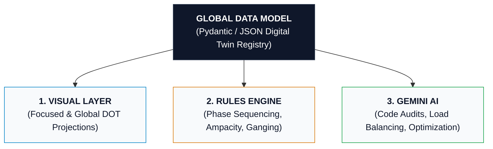
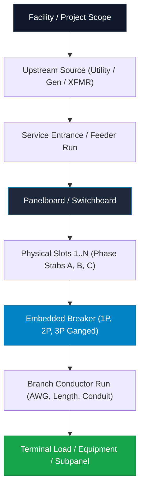

# JEMBY DIGITAL TWIN: Concept of Operations (CONOPS)
**Interactive Electrical Digital Twin, Multi-Scale Graph Visualizer, & AI Analysis Engine**

---

## 1. Executive Summary & Vision

The **JEMBY Digital Twin** is an intelligent, physics-aware modeling platform for electrical power distribution systems. Unlike traditional static CAD software or abstract single-line diagram (SLD) tools, JEMBY treats electrical infrastructure as a **strongly-typed, relational object graph (Digital Twin)**.

Every component in a facility—from high-voltage utility feeds, transformers, switchboards, and distribution panelboards, down to embedded circuit breakers, branch conductors, and end-use loads—is instantiated as an autonomous object with defined electrical behaviors, physical containment hierarchies, and regulatory constraints.

This structured representation enables a three-pillar operational capability:
1. **Multi-Scale Visual Projections**: Dynamically rendering both high-level system topology (Global SLD) and high-fidelity physical equipment views (e.g., dual-column Panel Schedules with port-level wiring terminals) using browser-compiled Graphviz DOT.
2. **Deterministic Domain Rules Engine**: Automatically enforcing electrical physics (phase sequencing, ganged multi-pole trip mechanics, ampacity sizing, continuous load limits).
3. **Gemini AI Semantic & Analytical Engine**: Providing AI-driven NEC code compliance auditing, phase load balancing optimization, selective coordination validation, and natural-language design automation.

---

## 2. System Architecture: The Digital Twin Triad

The JEMBY architecture decouples data integrity from presentation and intelligence across three tightly integrated layers:

### 2.1 The Global Object Registry (Single Source of Truth)
Every electrical asset exists as a uniquely identifiable instance in a unified project graph. The model stores:
* **Intrinsic Attributes**: Electrical ratings (voltage, bus ampacity, kVA, AIC/SCCR, enclosure NEMA rating).
* **Containment Hierarchies**: Parent-child relationships (e.g., a Panelboard contains Slots; Slots contain Breakers).
* **Topology & Connectivity**: Explicit port-to-port connections via Conductor objects (e.g., `MDP:ckt_17_19` → `Feeder_10AWG` → `HVAC_Unit:L1_L2`).

### 2.2 Dual-Mode Visual Projections
The visual engine generates Graphviz DOT representations on demand from the underlying JSON state:
* **Global System SLD**: Macro-level overview showing power distribution from utility/generator down through switchboards, transformers, and subpanels.
* **Focused 1st-Degree Physical View (Drill-Down)**: Micro-level view placing a single selected equipment item at center stage, rendered with physical realism (e.g., dual-column panel schedule table), alongside its direct upstream sources and downstream branch loads.

### 2.3 Graphviz DOT HTML Table & Port Mapping
Visual realism and interactivity are achieved using Graphviz HTML-like label tables:
* Every circuit position is an explicit `<td port="ckt_N">` cell.
* Multi-pole ganged breakers span multiple rows or link with visual handle ties.
* Outgoing conductor edges bind strictly to breaker port terminals, preserving precise physical wiring origins.

---

## 3. Physical Entity Hierarchy & Containment Model

### 3.1 Panelboard Object (`Panel`)
* **Identifiers**: `panel_id`, `tag` (e.g., `MDP-1`), `location`, `name`.
* **System Electrical Parameters**:
  * Phase configuration: `1PH_3W` (120/240V) or `3PH_4W` (208Y/120V, 480Y/277V).
  * Bus Ampacity: `100A`, `200A`, `225A`, `400A`, `800A`, etc.
  * Mains Type: `MCB` (Main Circuit Breaker) or `MLO` (Main Lugs Only).
  * Short-Circuit Current Rating (SCCR): e.g., `22kA`, `65kA`.
  * Total Physical Spaces / Slots: `12`, `24`, `30`, `42`, `84`.

### 3.2 Embedded Breaker Object (`Breaker`)
Breakers live inside panel slots as first-class embedded objects:
* **Occupied Slots**: List of slot numbers (e.g., `[1]` for 1-pole; `[17, 19]` for 2-pole; `[1, 3, 5]` for 3-pole).
* **Poles & Ganging**:
  * Number of poles: `1`, `2`, `3`.
  * Common Internal Trip mechanism & physical handle tie linkage.
* **Ratings**:
  * Trip Ampacity: `15A`, `20A`, `30A`, `50A`, `100A`, etc.
  * Frame Size: `100A`, `225A`.
  * Interrupting Capacity (AIC): `10kA`, `22kA`, `65kA`.
  * Protection Type: Standard Thermal-Magnetic, GFCI, AFCI, Dual-Function (CAFCI/GFCI).
* **Operational State**: `ON`, `OFF`, `TRIPPED`, `SPARE`, `SPACE`.

### 3.3 Conductor / Branch Circuit Run (`Cable` / `Feeder`)
* **Conductor Specs**: Size (`14 AWG` to `500 kcmil`), Material (`Cu` / `Al`), Insulation (`THHN`, `XHHW-2`).
* **Installation**: Length in feet, Conduit type (`EMT`, `PVC`, `RMC`, `MC Cable`).
* **Calculated Values**: Conductor impedance, ampacity derating, calculated voltage drop ($V_d$).

### 3.4 Load / Downstream Asset (`Load`)
* Name, equipment category (Lighting, Receptacle, Motor, HVAC, EV Charger, Sub-panel).
* Operating Voltage, Connected kVA / kW, Power Factor ($PF$), Duty Cycle (Continuous vs Non-Continuous).

---

## 4. Domain Intelligence & Physical Rules Engine

The Digital Twin automatically computes and enforces electrical principles:

### 4.1 Bus Stab Phase Sequencing
Panel interior stabs alternate phases down the column rows according to standard industry bus geometry:

| Row Number | Left Slot | Right Slot | Single-Phase (120/240V) | Three-Phase (208Y/120V or 480Y/277V) |
|:---:|:---:|:---:|:---:|:---:|
| **Row 1** | Slot 1 | Slot 2 | **Phase A** | **Phase A** |
| **Row 2** | Slot 3 | Slot 4 | **Phase B** | **Phase B** |
| **Row 3** | Slot 5 | Slot 6 | **Phase A** | **Phase C** |
| **Row 4** | Slot 7 | Slot 8 | **Phase B** | **Phase A** |
| **Row 5** | Slot 9 | Slot 10 | **Phase A** | **Phase B** |
| **Row 6** | Slot 11 | Slot 12 | **Phase B** | **Phase C** |

### 4.2 Multi-Pole Ganging Rules
* A **2-Pole Breaker** on the left column must occupy vertically adjacent odd slots (e.g., $17$ & $19$), spanning **Phase A + Phase B** to deliver 240V (or 208V).
* A **3-Pole Breaker** must occupy three consecutive slots on the same side (e.g., $1, 3, 5$), spanning **Phase A + Phase B + Phase C**.
* A single load port (e.g., `port="ckt_17_19"`) is exposed for the ganged unit.
* Switching any pole to `OFF` or `TRIPPED` updates the entire ganged assembly synchronously.

### 4.3 Phase Load Balancing
* The system computes per-phase total volt-amperes ($VA_A$, $VA_B$, $VA_C$).
* Phase unbalance percentage is calculated continuously:
  $$\% \text{ Unbalance} = \frac{\max(|VA_A - VA_{\text{avg}}|, |VA_B - VA_{\text{avg}}|, |VA_C - VA_{\text{avg}}|)}{VA_{\text{avg}}} \times 100$$
* The model flags unbalance exceeding NEC/industry targets ($> 10\%$).

### 4.4 Sizing & Protection Constraints
* **Continuous Load Sizing (NEC 210.20)**: Overcurrent protection must be sized at $\ge 125\%$ of continuous load $+ 100\%$ of non-continuous load.
* **Maximum Voltage Drop (NEC 210.19 Informational Note 4)**: Flags branch circuits where estimated drop exceeds $3\%$ (or $5\%$ total system drop).

---

## 5. Panel Lifecycle & Interaction Flow

1. **Creation**: User instantiates a panel from the catalog (e.g., 24-space 200A 120/240V Panelboard).
2. **Attribute Configuration**:
   * Set mains rating, enclosure, voltage system.
   * Add/populate breakers in slots (1P, 2P, 3P, spare, space).
   * Connect loads and branch conductors.
3. **Model & Rules Execution**:
   * System validates slot availability and phase continuity.
   * Auto-assigns phase legs to each breaker pole.
   * Validates continuous load limits and bus capacity.
4. **Visual & AI Projection**:
   * Generates Focused DOT HTML Schedule Table with clickable ports.
   * Passes structured payload to Gemini for automated validation and optimization.

---

## 6. Gemini AI Analytical Capabilities

By converting electrical systems into a structured digital twin, Gemini functions as an active engineering co-pilot:

1. **Automated NEC Code Audits**: Scans the entire project graph for violations (undersized conductors, overloaded breakers, improper neutral sizing, missing AFCI/GFCI protection in wet/living areas).
2. **Intelligent Load Balancing**: Recommends optimal breaker slot relocations to balance phase loads within $\pm 2\%$.
3. **Natural Language System Authoring**:
   * *"Add a 48A Level 2 EVSE to Subpanel B. Find the best slot pair on underloaded phases, size the 2-pole breaker, and specify the conductor."*
4. **Selective Coordination & Fault Level Auditing**: Analyzes upstream-to-downstream trip curves to ensure faults isolate locally without taking down the main distribution board.

---

## 7. Next Implementation Steps

1. **Panel & Breaker Data Schemas**: Define Pydantic models for `PanelConfig`, `SlotAssignment`, `BreakerObject`, and `Conductor` in `james_app/models.py`.
2. **Phase Determination Engine**: Build utility functions to compute phase assignments and ganged slot linkages.
3. **Focused Panel DOT Compiler**: Implement the HTML table schedule generator with dual-column layout and `<td port="...">` anchors.
4. **Interactive Schedule Editor**: Build an HTMX-driven dual-column panel schedule editor allowing direct breaker configuration and slot management.
