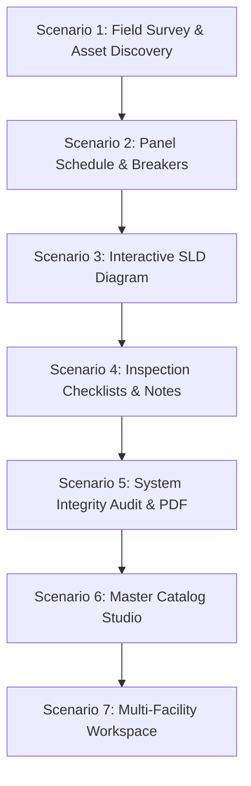

# BuildingAware (JAMES) - Interactive Demo Scenarios & Script Guide

## Executive Overview
**BuildingAware (JAMES)** is an intelligent electrical digital twin and field surveying platform designed for electrical engineers, facility managers, and safety auditors. It transforms physical electrical distribution systems into connected, code-validated digital models backed by SQLite, Git-friendly JSON Lines, and automated IEEE/NEC compliance engines.

This document outlines **7 high-impact demonstration scenarios** suitable for executive briefings, technical customer demos, and field surveyor training.

---

---

## Scenario 1: Fast Field Walkthrough & Digital Twin Ingestion
**Persona**: Field Survey Technician / Electrical Auditor  
**Goal**: Demonstrate how fast and intuitive it is to survey physical equipment in a commercial or industrial facility on an iPad or laptop.

### Demonstration Steps:
1. **Navigate to Survey Workbench** (`/survey`).
2. **Archetype Selection**:
   - In **Column 1 (Domains)**, click **⚡ Power Sources** or **🗄️ Panelboards & MCC**.
   - In **Column 2 (Equipment Types)**, click **Lighting Branch Panel (LP)**.
   - *Talking Point*: *"Notice how JAMES automatically scans the facility stack and suggests the next sequential tag (`LP-2` if `LP-1` already exists), preventing tag duplication."*
3. **Set Equipment Specs**:
   - Location: Select `Level 1 - Electrical Closet 102`.
   - Voltage: `208Y/120V 3Ø 4W`.
   - Bus Rating: `225A` (observe automatic NEC copper wire sizing: `4/0 AWG Cu`).
4. **Link Upstream Power Tree (`Fed From`)**:
   - Open the **Fed From** dropdown.
   - Select `T-1 (75 kVA Step-Down Transformer)`.
   - *Talking Point*: *"The smart hierarchy engine automatically filters out terminal loads and prevents cyclical circular references."*
5. **Capture Photo Evidence & Notes**:
   - Tap **📷 Snap Photo / Upload** to attach a nameplate photo.
   - Add a field observation: `"Clean enclosure, mounted flush on north wall."`
6. **Save to Stack**: Click **💾 Save Equipment**. Observe the asset immediately appearing in **Column 4 (Facility Stack)**.

---

## Scenario 2: Interactive Panel Schedule, Breaker Ganging & Unresolved Loads
**Persona**: Senior Electrical Engineer / Project Estimator  
**Goal**: Showcase the NEMA-accurate odd/even 3-phase panel schedule and automated breaker linking.

### Demonstration Steps:
1. Open **`MDP-1` (Main Distribution Switchboard, 42 Slots)** in the equipment editor drawer.
2. **Observe 3-Phase Color-Coded Rotation**:
   - Show the middle **`Ph`** column with anchored badges:
     - 🔴 **Phase A** (Red)
     - 🔵 **Phase B** (Blue)
     - 🟢 **Phase C** (Emerald)
   - *Talking Point*: *"The alternating bus stabs accurately represent physical panel internals (Rows 1-2 = A, Rows 3-4 = B, Rows 5-6 = C)."*
3. **Configure a 3-Pole Feeder Breaker**:
   - Click **Slot 1** (Feeder to Transformer `T-1`).
   - Select **3-Pole** in the Breaker Inspector.
   - Pick an OEM catalog model: `Square D PowerPact H-Frame 100A 65kAIC`.
   - Observe how Slots 3 and 5 are automatically ganged across all three phases (`Phase A`, `Phase B`, `Phase C`).
4. **Resolve Connected Loads with One Click**:
   - If a downstream panel (e.g. `LP-1A`) was added with `Fed From: MDP-1`, observe the amber **`⚠️ Unresolved Connected Loads`** banner above the schedule.
   - Click **Resolve ↗**.
   - The inspector automatically selects the downstream asset and finds the first available 3-pole slot pair.
   - Click **Save Breaker** to link the circuit.

---

## Scenario 3: Live Single-Line Diagram (SLD) Compilation
**Persona**: Consulting Engineer / Facility Architect  
**Goal**: Demonstrate real-time Graphviz WebAssembly diagram synthesis directly from the digital twin.

### Demonstration Steps:
1. Click **⚡ SLD Diagram** in the top navigation (`/sld`).
2. **Observe Live Rendering**:
   - Point out the hierarchical tree flow:  
     `UTIL-1 (Utility Grid) ➔ ATS-1 (Transfer Switch) ➔ MDP-1 (Main Switchboard) ➔ T-1 (Transformer) ➔ LP-1A (Branch Panel)`
   - Show standby generation branch: `GEN-1 ➔ ATS-1`.
3. **Canvas Navigation**:
   - Use the mouse wheel or pinch-to-zoom for smooth canvas navigation.
   - Click **Fit to Screen** or toggle layout orientation (Top-to-Bottom vs Left-to-Right).
4. **Interactive Node Inspection**:
   - Click any equipment box on the SVG diagram (e.g., `MDP-1` or `T-1`).
   - The slide-over editor drawer immediately opens with the full equipment record and panel schedule.
   - Edit an attribute (e.g., change AIC from `65 kAIC` to `100 kAIC`) and save.
   - The single-line diagram instantly re-compiles and updates in under 200 milliseconds.
5. **Export**: Click **Export SVG** or **Export DOT** for CAD / engineering deliverables.

---

## Scenario 4: Field Inspection Checklists, Deficiency Tagging & Sign-Off
**Persona**: Safety Inspector / Commissioning Agent  
**Goal**: Demonstrate standards-compliant inspection workflows with one-tap defect chips and digital sign-off.

### Demonstration Steps:
1. Open `MDP-1` or `LP-1A` in the editor drawer and click the **📋 Checklists** tab.
2. **Domain-Specific Protocols**:
   - Show how inspection checklists load based on equipment domain (e.g. *Visual Inspection, Working Space & NEC 110.26 Clearance, Arc Flash Labeling, Torque Verification*).
3. **1-Tap Status Lifecycle**:
   - Click **Pass (✓)** on *Enclosure Integrity & Secure Mounting*.
   - Click **Deficient (⚠️)** on *NEC 110.26 Working Clearances*.
4. **Auto-Revealed Deficiency Notes & One-Tap Preset Chips**:
   - Notice that marking an item as `Deficient` immediately expands the notes textarea with warning styling.
   - Tap preset pills to instantly populate pithy field tags:
     - `+ Clearance < 36"`
     - `+ Label Missing`
     - `+ Torque Unverified`
     - `+ Missing Filler Plate`
     - `+ Arc Flash Expired`
5. **Filter & Live Compliance Metric**:
   - Toggle filters: `All (14)`, `Deficient (1)`, `Pending (2)`, `Passed (11)`.
   - Observe the live score badge: `92% Compliant (1 Deficiency)`.
6. **Inspector Sign-Off**:
   - Enter inspector name: `Jane Doe, PE`.
   - Click **Sign Off Inspection**.
   - A permanent timestamped verification badge is stamped onto the digital twin record.

---

## Scenario 5: Automated System Integrity Audit & Publication-Ready PDF
**Persona**: Chief Electrical Engineer / Insurance Underwriter / AHJ  
**Goal**: Demonstrate automated NEC/IEEE engineering rule checks and server-side PDF report compilation.

### Demonstration Steps:
1. Open the **Toolbox (🧰)** in the top header and click **🛡️ Run Integrity Audit**.
2. **Deterministic Rule Engine Checks**:
   - **Voltage Class Continuity**: Flags if a 480V panel directly feeds a 208V panel without a transformer.
   - **Capacity & Headroom Analysis**: Verifies that upstream breakers have sufficient ampacity headroom for downstream load MCA/FLA.
   - **AIC Fault Withstand**: Flags equipment with withstand ratings lower than available fault current.
   - **Single Point of Failure (SPOF)**: Highlights non-redundant critical distribution paths.
3. **Review Audit Scorecard**:
   - Point out the **Facility Health Score** (e.g. `88 / 100`) and categorized badges (Critical, Warning, Info).
   - Click **Inspect Asset ↗** on a finding to jump straight to the offending equipment for correction.
4. **Generate Publication-Grade PDF**:
   - Click the **🖨️ Print / PDF** button.
   - *Talking Point*: *"Rather than printing a messy browser screenshot, JAMES executes server-side typography to render a formal report with executive summary tables, health scorecards, itemized deficiency logs, and facility power trees."*
5. **Alternative Exports**: Click **📝 Export Markdown (TOC)** or **📊 Export CSV** for spreadsheet integration.

---

## Scenario 6: Master Vendor Catalog Studio & Cut-Sheet PDF Viewer
**Persona**: Procurement Specialist / Electrical Estimator  
**Goal**: Show the verified 5,000+ manufacturer component catalog and integrated technical documentation.

### Demonstration Steps:
1. Navigate to **📚 Catalog Studio** (`/catalog`).
2. **Filter by Manufacturer & Archetype**:
   - Select Manufacturer: `Square D / Schneider Electric`.
   - Select Archetype: `Molded Case Circuit Breaker (MCCB)`.
   - Filter by Pole Count: `3-Pole`, Trip Rating: `100A - 400A`.
3. **Inspect Catalog Item**:
   - View real-world Frame sizes, Series (e.g., `PowerPact H / J`), AIC ratings (`25kA`, `65kA`, `100kA`), and mounting styles (`Bolt-on`, `I-Line`).
4. **Embedded PDF Technical Cut-Sheets**:
   - Click **View Cut-Sheet ↗** on any indexed part.
   - The integrated PDF viewer loads the manufacturer's technical document with zoom, page navigation, and search highlights.

---

## Scenario 7: Multi-Facility Workspaces, Offline-First & Knowledge Base
**Persona**: Enterprise Operations Lead / Fleet Manager  
**Goal**: Showcase enterprise client isolation, offline resilience, and searchable engineering standards.

### Demonstration Steps:
1. **Facility Database Switching**:
   - Press **`Cmd + O`** (or open Toolbox 🧰 ➔ **Facility Finder**).
   - Show multiple client workspaces (e.g. `zoetis / b4`, `zoetis / b17_test`, `pfizer / plant_1`).
   - Switch between facilities instantly without page reloads.
2. **Search the Integrated Knowledge Base**:
   - In the Toolbox Help & FAQ search bar, type: `"arc flash labeling"` or `"working clearance"`.
   - Show deep-linked search results pointing directly to indexed PDF standards (e.g. `QSG-Arc Flash Labeling.pdf`, Page 1).
3. **Display Scaling & Low-Light Theme**:
   - Toggle **🌙 Dark Mode** for dimly lit electrical basements and **☀️ Light Mode** for outdoor substations.
   - Adjust Font & UI Scaling (Compact, Standard, Large Touch) for tablet field ergonomics.
4. **Dual Persistence Verification**:
   - Open the data folder to show atomic SQLite (`model.db`) operating in tandem with Git-friendly JSON Lines (`model.jsonl`).

---

## Quick Reference Demo Cheat Sheet

| Feature | Where to Click | Key Talking Point |
|:---|:---|:---|
| **Survey Discovery** | `/survey` ➔ Left Columns | 10 standard digital twin domains; auto-incrementing tags |
| **Panel Schedule** | Survey / SLD Drawer ➔ Schedule | NEMA odd/even 3-phase layout with color-coded A/B/C badges |
| **SLD Diagram** | `/sld` in Top Header | Real-time Graphviz WebAssembly rendering in <200ms |
| **Checklists** | Equipment Drawer ➔ Checklists Tab | 1-tap deficiency status + preset defect pill chips |
| **Integrity Audit** | Header 🧰 ➔ Run Integrity Audit | Deterministic NEC/IEEE rule validation + Health Score |
| **PDF Report** | Audit Modal ➔ 🖨️ Print / PDF | Publication-grade server-side formatted engineering audit report |
| **Catalog Studio** | `/catalog` in Top Header | 5,000+ verified OEM parts with integrated PDF cut-sheets |
| **Facility Finder** | Header Pill or `Cmd + O` | Instant multi-client workspace switching with zero reload |

---

*Prepared by BuildingAware Engineering Team — Powered by JAMES Digital Twin Platform.*
