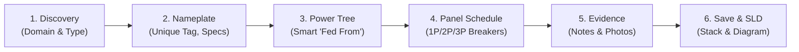

# JEMBY JAMES Digital Twin - Field Data Collector Workflow & Field Guide

## 1. Executive Summary & Overview
The **JAMES Field Data Collector Workbench** is an interactive, responsive, multi-column survey platform designed for electrical engineers and field survey technicians operating on iPads and tablets during facility walk-through audits.

It bridges the gap between raw physical nameplates, panelboard breaker schedules, and photographic evidence, compiling them into a connected electrical Digital Twin backed by an atomic SQLite database (`model.db`) and a portable, Git-friendly JSON Lines companion file (`model.jsonl`).

---

## 2. Core 6-Step Field Survey Workflow

### Step 1: Equipment Discovery & Archetype Selection
- **Column 1 (Domains)**: Tap the primary equipment domain (*Power Sources, Transformers, Switches & ATS, Panelboards & MCC, Power Quality & UPS, Electrical Loads, Conductors, Metering, Renewables*).
- **Column 2 (Equipment Types)**: Select the archetype (e.g. *Lighting Branch Panel `LP`*, *Main Distribution Panel `MDP`*, *Motor Control Center `MCC`*, *Dry-Type Step-Down Transformer `XFMR`*).
- **Auto-Incrementing Tags**: When selecting an archetype, JAMES automatically scans existing assets in the facility stack and assigns the next available unique suffix (e.g., if `LP-1` exists, selecting Lighting Panel automatically defaults to `LP-2`).
- **Catalog Toggle**: Once familiar with the equipment in a room, tap **`◀ Hide Catalog`** to collapse Columns 1 & 2 and grant 100% of the tablet display to the Nameplate Form and Facility Stack.

### Step 2: Nameplate Specifications & Location
- **Unique Equipment Tag**: Every asset must have a unique tag (e.g. `LP-1A`, `XFMR-1`, `ATS-1`).
  - **Duplicate Tag Guard**: Real-time validation checks for collisions across the facility stack. If a duplicate tag is entered, an amber `⚠️ Tag in use` warning badge appears and the Save button is locked until a unique tag is provided.
- **Physical Room**: Electrical closet or room location (e.g. `Level 1 - Electrical Room 101`).
- **Electrical Physics**: Specify Voltage configuration (e.g. `480Y/277V 3Ø 4W`, `208Y/120V 3Ø 4W`), Main Bus Ampacity (e.g. `225A`, `1200A`), and Short Circuit Withstand (`AIC / kAIC`).
- **Automatic Conductor Sizing**: JAMES dynamically calculates NEC standard copper conductor sizes (e.g., 225A → `4/0 AWG Cu`, 1200A → `4x 500 kcmil Cu`).

### Step 3: Upstream Hierarchy Link (`Fed From`)
- Select the upstream parent feeding asset from the **Fed From** dropdown.
- **Smart Physical Feeder Filtering**:
  - **Primary Sources** (Utility grid entrance, Standby generator, Solar PV) have no upstream feeder (`-- None / Service Entrance --`).
  - **Cycle Prevention**: Equipment cannot feed itself, nor can it be fed by its own downstream descendants.
  - **Loads Never Feed Upstream**: Terminal loads (chillers, pumps, motors, EV chargers) are automatically excluded from all `Fed From` feeder lists.
- This deterministic link establishes the electrical tree:
  `UTIL-1 → ATS-1 → MDP-1 → T-1 → LP-1A`

### Step 4: Embedded Panelboard Breaker Schedule
- For panels, switchboards, and MCCs, Column 3 renders an interactive odd/even slot matrix (12, 18, 24, 30, 42, 54, 72, or 84 slots).
- Click any slot row to launch the **Circuit Breaker Inspector**:
  - **1-Pole (120V / 277V L-N)**: 1 slot on a single phase (A, B, or C).
  - **2-Pole (208V / 480V L-L)**: 2 vertical slots spanning alternating phases (e.g. Slots 1 & 3 = Phase A-B).
  - **3-Pole (208V / 480V 3Ø)**: 3 vertical slots spanning all 3 phases (Slots 1, 3, 5 = Phase A-B-C).
  - **Trip Ratings & Types**: 15A to 225A ratings with MCCB, AFCI, GFCI, DF, MCP, or LSI trip units.
  - **Smart Downstream Linking**: Link the breaker circuit to valid downstream loads (e.g. `CH-1`, `PUMP-1`). Upstream feeding ancestors and grid utility entrances are automatically excluded.
  - **Spare / Space**: Click `🗑️ Remove / Make Space` to clear the breaker back to an unassigned spare slot.

### Step 5: Field Notes, Multi-Photo Capture & Lightbox
- **`📷 Snap Photo`**: Directly invokes the tablet's hardware rear camera for instant nameplate or hazard photography.
- **`➕ Add Photos`**: Multi-select upload from the device image library.
- **Staging Tray**: Previews thumbnails with a red corner `✕` button to discard unwanted shots before saving.
- **Fullscreen Lightbox**: Tap any thumbnail in a saved note to inspect high-resolution images, view timestamps, and download.
- **Zero Broken Links**: All photos are encoded directly into SQLite and the `.jsonl` companion file as self-contained Base64 Data URLs.

### Step 6: Saving, Re-Editing, and SLD Generation
- Click **Save / Update** to commit the asset into **Column 4 (Facility Stack)**.
- **Unsaved Changes Safety Guard**: If you modify fields and accidentally switch assets, an interception modal provides `[💾 Save & Switch]`, `[🗑️ Discard & Switch]`, and `[Keep Editing]`.
- **Facility Stack Grouping**: View by **📍 Room**, **⚡ Power Tree**, or **📦 Equipment Type**.
- **⚡ View SLD Diagram**: Compiles the Graphviz single-line drawing directly from the digital twin.
- **📋 Export JSONL**: Downloads the facility model for CAD/GIS or version control.

---

## 3. Standard NEMA Bus Stab & Phase Architecture

In North American electrical panelboards (NEMA / UL 67), bus stabs alternate rows vertically:

| Row | Left Slot (Odd) | Phase Stab | Right Slot (Even) | System Line Voltage |
| :---: | :---: | :---: | :---: | :---: |
| **1** | **Slot 1** | 🔴 **Phase A** | **Slot 2** | 120V / 277V to Neutral |
| **2** | **Slot 3** | 🔵 **Phase B** | **Slot 4** | 120V / 277V to Neutral |
| **3** | **Slot 5** | 🟢 **Phase C** | **Slot 6** | 120V / 277V to Neutral |
| **4** | **Slot 7** | 🔴 **Phase A** | **Slot 8** | 120V / 277V to Neutral |
| **5** | **Slot 9** | 🔵 **Phase B** | **Slot 10** | 120V / 277V to Neutral |
| **6** | **Slot 11** | 🟢 **Phase C** | **Slot 12** | 120V / 277V to Neutral |

---

## 4. Pro-Tips for Field Technicians

1. **Tag Integrity**: Duplicate equipment tags are blocked automatically; let archetype auto-incrementing speed up panel tagging (`LP-1`, `LP-2`, `LP-3`).
2. **Maximize Screen Real-Estate**: Use `◀ Hide Catalog` on tablets to focus on the active breaker matrix and stack.
3. **Fast Guide Access**: Press `?` on a physical keyboard or tap `📖 Field Guide` in the header.
4. **Emergency Discard**: Press `Esc` to instantly dismiss any open modal or photo lightbox.
5. **Lighting Conditions**: Switch between `🌙 Dark Mode` (for dark electrical rooms) and `☀️ Light Mode` (for bright outdoor substations).
