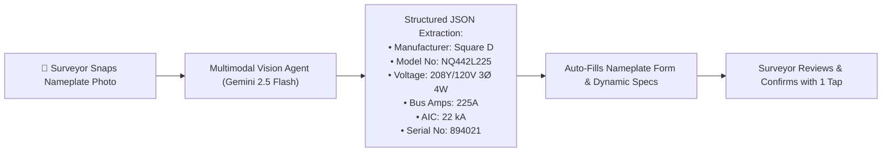
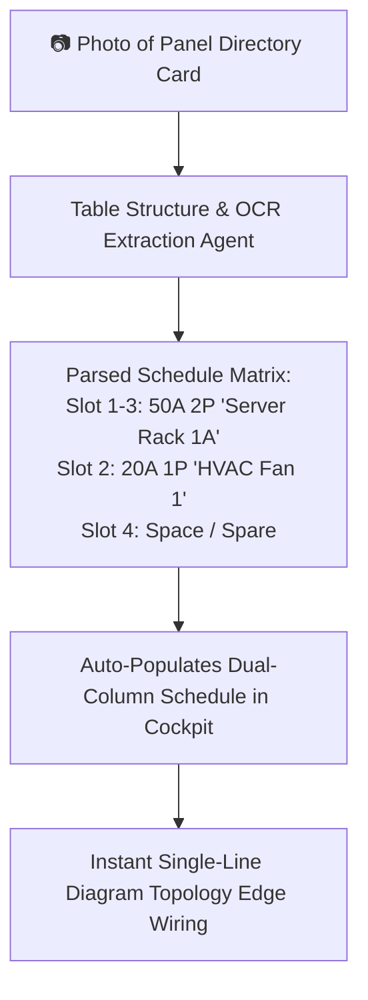
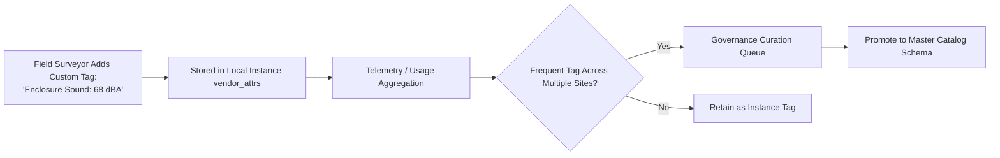
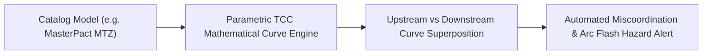
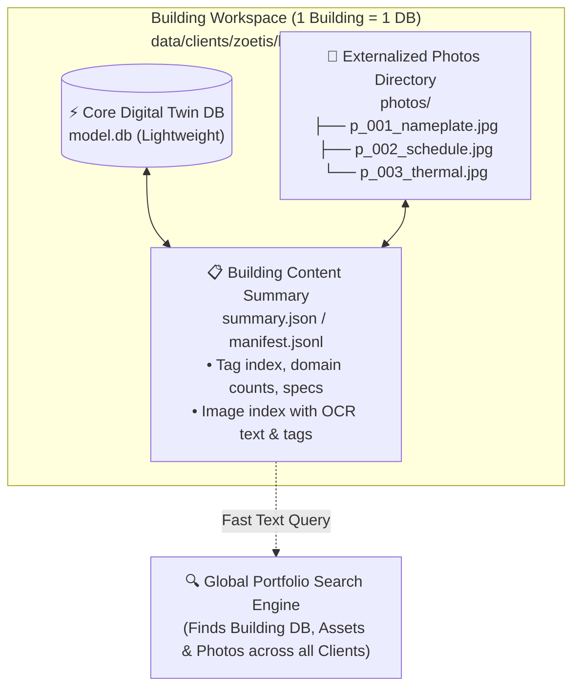

# JEMBY / JAMES: Future Innovations & AI Roadmap

This document outlines the strategic future capabilities, advanced AI integrations, and architectural enhancements planned for the **JEMBY JAMES Electrical Digital Twin Platform**.

---

## 1. Multimodal AI Nameplate OCR & Field Vision Engine

### 1.1 Overview
Surveyors spend substantial on-site time manually transcribing worn, stamped metal nameplates across hundreds of facility electrical assets. The AI Vision Engine will enable surveyors to snap a single photo of an equipment nameplate, with Gemini Multimodal models automatically parsing, extracting, and populating structured attributes in the Cockpit.

### 1.2 Key Features:
* **Glare & Wear Invariance**: Processes stamped metal plates, embossed lettering, weathered outdoor tags, and dot-peen markings under uneven lighting.
* **Fuzzy Master Catalog Resolution**: Reconciles partially worn model numbers (e.g., `NQ44...`) against the Master Catalog to complete missing engineering ratings.
* **Contextual Dynamic Attribute Mapping**: Automatically extracts specialized archetype parameters (e.g., `%Z = 5.75%` for transformers, `Prime kW = 750` for generators, or `Class R Fuses = 100A` for disconnects) directly into `vendor_attrs`.
* **Human-in-the-Loop Validation**: Highlights extracted values in the Cockpit UI with visual confidence indicators for instant surveyor verification.

---

## 2. Panel Directory OCR & Automated Schedule Digitization

### 2.1 Overview
Physical paper panel directories taped inside panelboard doors often contain handwritten or typewritten circuit descriptions, breaker sizes, and load destinations. 

### 2.2 Key Features:
* **Handwritten & Typewritten Text Recognition**: Reads handwritten circuit descriptions and pencil marks.
* **Slot Alignment & Multi-Pole Detection**: Distinguishes 1-pole, 2-pole, and 3-pole tied breakers and assigns them to odd/even left/right slot positions.
* **Automatic Downstream Load Mapping**: Parses circuit names (e.g., `AHU-3`, `Lighting ER-101`, `Chiller Pump 2`) and automatically matches them to existing equipment in the stack.

---

## 3. Master Catalog Governance & Field Back-Propagation

### 3.1 Overview
When field surveyors discover and record novel equipment attributes using the **`➕ Add Field Attribute`** tool, these tags initially attach strictly to that individual asset instance. This preserves catalog hygiene while offering infinite field flexibility.

### 3.2 Key Features:
* **Per-Instance Isolation**: Ensures field creativity does not pollute global schemas or cause breaking database alterations.
* **Telemetry & Tag Frequency Heatmaps**: Identifies recurring custom parameters across client portfolios.
* **One-Click Promotion Workflow**: Catalog administrators can formally promote validated attributes into the global Master Catalog.

---

## 4. Time-Current Characteristic (TCC) & Selective Coordination

### 4.1 Overview
Integration between the Master Catalog breaker models and standardized Time-Current Curves (TCC) to automate electrical protection engineering.

### 4.2 Key Features:
* **Manufacturer Trip Curve Library**: Stores Long-Time (L), Short-Time (S), Instantaneous (I), and Ground-Fault (G) settings for Square D, Eaton, Siemens, and ABB trip units.
* **Automated Overlap Detection**: Warns engineers if a downstream branch breaker will trip upstream main protection.
* **Arc Flash Boundary Estimation**: Uses IEEE 1584 calculations based on breaker clearing times and short-circuit current.

---

## 5. Infrared (IR) Thermography & Field Sensor Integration

### 5.1 Overview
Direct attachment of thermal imaging camera data (FLIR, Seek Thermal) to circuit breaker slots, transformer coils, and cable lugs.

### 5.2 Key Features:
* **Radiometric Photo Embedding**: Stores thermal images with temperature metadata per slot.
* **Delta-T Thermal Anomaly Flagging**: Automatically calculates $\Delta T$ against adjacent phases and highlights overheating lugs in the SLD and Panel Schedule.
* **Preventive Maintenance Ticketing**: Generates immediate work orders for loose connections or phase load imbalances.

---

## 6. Offline-First Progressive Web App (PWA) Field Mode

### 6.1 Overview
Full offline operation for industrial basements, electrical vaults, mines, and remote substations with zero internet connectivity.

### 6.2 Key Features:
* **Local SQLite / WASM Storage**: Full client-side database running in the browser engine via WebAssembly.
* **Background Delta Sync**: Automatically reconciles and merges offline field surveys back into the central cloud repository when connectivity is restored.
* **Compressed Image Queuing**: Efficiently manages high-resolution nameplate and inspection photos offline before uploading.

---

## 7. Global Shared Master Catalog & Multi-Project Workspace Provisioning

### 7.1 Overview
The Master Catalog (`data/master_catalog.db`) functions as a single global source of truth across all survey projects. Each client facility maintains its own isolated digital twin SQLite database (`data/clients/{client_id}/{facility_id}/model.db`).

### 7.2 Key Features:
* **Shared Component Library**: All archetypes, voltage tiers, and manufacturer SKUs created in the Catalog Studio are instantly accessible to any survey project.
* **`[ + New Project... ]` Provisioning Wizard (under Files Menu)**: A dedicated workflow to spawn new client/facility projects, auto-create folder structures (`data/clients/{client_id}/{facility_id}/`), initialize clean SQLite `model.db` databases, and link to the global master catalog.
* **Dynamic Workspace Switching**: Allows surveyors to toggle between client facilities (e.g. *Zoetis B4*, *Pfizer CUP*, *Genentech B10*) on the fly without restarting the server.

---

## 8. Externalized Image Indexing & Searchable Database Summaries (1 Building = 1 DB)

### 8.1 Overview
To preserve high-speed query performance and prevent database bloat, photos are stored outside the primary transactional database while being fully indexed. Each physical building operates on its own dedicated SQLite database, with a companion JSONL / JSON summary index for global portfolio discovery.

### 8.2 Key Features:
* **1 Database = 1 Building Rule**: A project represents a company or campus location, with each physical building possessing exactly one dedicated SQLite database (`model.db`).
* **Externalized Image Storage**: High-resolution surveyor photographs are externalized to filesystem directories (`data/clients/{client_id}/{facility_id}/photos/{photo_id}.jpg`) or cloud object storage rather than stored as bulky inline base64 blobs in SQLite.
* **Searchable Image Metadata**: Photos are indexed with structured metadata (equipment tag, category: `nameplate`, `directory`, `overview`, `thermal_ir`, surveyor notes, and OCR-extracted text).
* **Companion Content Summaries (`manifest.jsonl`)**: Generates lightweight text summaries of each building's equipment inventory, service entrance capacities, and photo references. This allows engineers to locate any specific building database or equipment tag across thousands of sites instantaneously without opening individual SQLite binary files.

