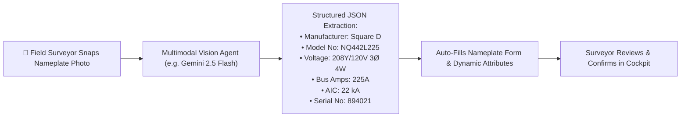
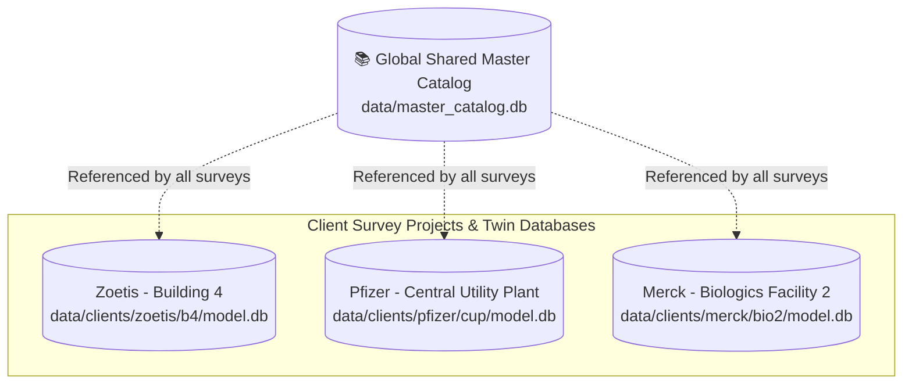

# Master Vendor & Model Catalog Architecture

## Overview
This architectural specification details the roadmap and schema for the **Master Vendor & Model Catalog** in the JEMBY / JAMES Electrical Digital Twin platform.

The Master Catalog enables:
1. **Automated Nameplate Population**: When a surveyor selects a manufacturer and model (e.g. *Square D NQ442L225* or *Caterpillar 3516B*), the system automatically pre-populates bus ampacity, voltage range, default AIC withstand, dimensions, weight, and standard circuit breaker/fuel configurations.
2. **Dynamic Nameplate Schema & Slot Attributes**: Standardizes vendor-specific parameters (`vendor_attrs`) per equipment class without rigid relational database migrations.
3. **Selective Coordination & Trip Curve Library**: Links equipment models to manufacturer Time-Current Characteristic (TCC) curve equations for arc flash and breaker trip studies.

---

## 1. Data Schema for Master Vendor Catalog

```json
{
  "vendors": {
    "square_d": {
      "name": "Square D / Schneider Electric",
      "country": "USA / Global",
      "domains": ["panels", "switches", "transformers", "protection"],
      "models": {
        "NQ": {
          "category": "Lighting & Appliance Panelboard",
          "voltage_options": ["208Y/120V 3Ø 4W", "120/240V 1Ø 3W", "240V 3Ø 3W"],
          "bus_amps_options": [100, 225, 400, 600],
          "default_aic_ka": 22,
          "slot_options": [18, 30, 42, 54, 72, 84],
          "bus_material": ["Tin-Plated Aluminum", "Copper"],
          "mains_type": ["MCB", "MLO"],
          "vendor_attrs_schema": {
            "interior_type": { "type": "select", "options": ["Standard", "Subfeed Lugs", "Feed-Through Lugs"] },
            "trim_type": { "type": "select", "options": ["Mono-Flat Surface", "Flush", "Hinged Door-in-Door"] },
            "spd_integrated": { "type": "boolean", "default": false }
          }
        },
        "QED-2": {
          "category": "Main Distribution Switchboard",
          "voltage_options": ["480Y/277V 3Ø 4W", "208Y/120V 3Ø 4W"],
          "bus_amps_options": [800, 1200, 1600, 2000, 2500, 3000, 4000, 5000],
          "default_aic_ka": 65,
          "vendor_attrs_schema": {
            "section_type": { "type": "select", "options": ["Main Only", "Main + Distribution", "Distribution Only", "Tie Section"] },
            "main_device": { "type": "select", "options": ["MasterPact MTZ Drawout", "PowerPact P-Frame", "Molded Case"] },
            "bus_bracing_ka": { "type": "number", "default": 65 }
          }
        }
      }
    },
    "caterpillar": {
      "name": "Caterpillar Inc.",
      "domains": ["sources"],
      "models": {
        "3516B": {
          "category": "Standby Diesel Generator Set",
          "voltage_options": ["480Y/277V 3Ø 4W", "4160V 3Ø"],
          "kw_standby": 2000,
          "kw_prime": 1825,
          "rpm": 1800,
          "vendor_attrs_schema": {
            "fuel_type": { "type": "select", "options": ["Diesel #2", "Biodiesel B20", "Natural Gas"] },
            "controller": { "type": "select", "options": ["EMCP 4.2B", "EMCP 4.4", "Legacy EMCP II"] },
            "fuel_tank_gallons": { "type": "number", "default": 1000 },
            "enclosure_sound": { "type": "select", "options": ["Open Skid", "Weatherproof", "Sound Attenuated Level 2"] }
          }
        }
      }
    },
    "asco": {
      "name": "ASCO Power Technologies",
      "domains": ["switches"],
      "models": {
        "7000_Series": {
          "category": "Automatic Transfer Switch (ATS)",
          "voltage_options": ["480Y/277V 3Ø 4W", "208Y/120V 3Ø 4W"],
          "bus_amps_options": [150, 200, 400, 600, 800, 1000, 1200, 2000, 3000, 4000],
          "vendor_attrs_schema": {
            "transition": { "type": "select", "options": ["Open Transition", "Closed Transition (Soft Load)", "Delayed Transition"] },
            "bypass_isolation": { "type": "boolean", "default": true },
            "controller": { "type": "select", "options": ["Group G Controller", "Group 5 Controller"] },
            "cam_lock_inlet": { "type": "boolean", "default": false }
          }
        }
      }
    }
  }
}
```

---

## 2. Dynamic Attribute Slot Architecture

In the field data collector and single-line diagram engine, every asset record maintains a flexible **`vendor_attrs`** slot inside its `attributes` payload:

```json
{
  "id": "s4",
  "tag": "MDP-1",
  "name": "Main Distribution Switchboard",
  "domain": "panels",
  "type_tag": "MDP",
  "room": "Main Electric Room 101",
  "fed_from": "ATS-1",
  "voltage": "480Y/277V 3Ø 4W",
  "amps": 1200.0,
  "aic": 65.0,
  "attributes": {
    "manufacturer": "Square D",
    "model_no": "QED-2",
    "asset_tag": "AST-ZOETIS-0042",
    "serial_no": "SN-8492041",
    "nema": "NEMA 1",
    "year_installed": 2018,
    "vendor_attrs": {
      "section_type": "Main + Distribution",
      "main_device": "PowerPact P-Frame",
      "bus_bracing_ka": 65
    }
  }
}
```

---

## 3. UI/UX Interaction Lifecycle

1. **Brand & Model Selection**:
   - Field surveyor picks `Square D` → `NQ` Panelboard.
2. **Auto-Fill Defaults**:
   - Auto-populates `Voltage: 208Y/120V`, `Mains: MCB`, `AIC: 22 kA`, `Slots: 42`.
3. **Contextual Nameplate Inputs**:
   - The form renders dynamic inputs matching the vendor schema for that model.
4. **Ad-Hoc Attribute Extensibility**:
   - Surveyors can add arbitrary custom `Key: Value` tags found on field nameplates.
5. **SLD & Inspector Integration**:
   - Nameplate badges, client asset tags, and model numbers appear in the Single-Line Diagram viewer and Inspector cards.

---

## 4. AI Vision & Nameplate OCR Extraction Roadmap

The photo capture architecture laid out in the Digital Twin Field Collector (`nameplate_photo` data structures) directly enables automated AI nameplate digitisation:



### Key Capabilities for Future AI Integration:
1. **Multimodal Nameplate OCR**: Extracts stamped metal nameplate text, wiring diagrams, and rating tables even under glare, dust, or low-light field conditions.
2. **Catalog Fuzzy Matching**: Matches partially legible model strings (e.g., `NQ442...`) to the nearest valid entry in the Master Catalog.
3. **Automated Dynamic Slot Population**: Maps specialized ratings (e.g., `%Z = 5.75%` on a transformer or `Prime kW = 750` on a generator) straight into `vendor_attrs`.
4. **Human-in-the-Loop Validation**: The extracted values pre-populate the Cockpit Column 3 editor with visual confidence highlights so the engineer can verify and save with a single tap.

---

## 5. Global Shared Catalog & Multi-Project Provisioning Architecture

### 5.1 Global Shared Catalog (Single Source of Truth)
The Master Catalog (`data/master_catalog.db`) operates as a **globally shared repository** across all survey projects, client organizations, and facility campuses:
* **Centralized Archetypes & SKUs**: Manufacturers, series, voltage tiers, ratings, and cut-sheets defined once in the Master Catalog Studio are immediately available to all field surveyors across every project.
* **Separation of Concerns**: Global catalog specs live independently from facility-specific digital twin instances (`model.db`), ensuring modifications to equipment libraries never corrupt or alter historical field project models.



### 5.2 Multi-Project Workspace & Database Provisioning Workflow
To streamline adding new facility surveys in the field, a **Project Management & Provisioning Tool** will be integrated (accessible under the **Files** menu / Project Switcher):

1. **`[ + New Project... ]` Modal Workflow**:
   - Prompts for **Client Name** (e.g. `Genentech`), **Client ID** (`genentech`), **Facility Name** (`Building 10 - Tech Ops`), and **Facility ID** (`b10`).
   - Optional base template selection (e.g., Blank, Industrial Substation, Commercial Office, Data Center).
2. **Automated Storage & Database Initialization**:
   - Auto-creates directory structure: `data/clients/{client_id}/{facility_id}/`.
   - Initializes clean SQLite digital twin database: `data/clients/{client_id}/{facility_id}/model.db` with standard tables (`equipment`, `buses`, `circuits`, `breakers`, `cables`).
   - Generates companion project manifest: `data/projects/{client_id}_{facility_id}.json`.
3. **Workspace Switching**:
   - Seamlessly transitions active Survey Workbench, SLD Diagram, and Companion JSONL exports to the newly provisioned project without requiring application server restarts.

