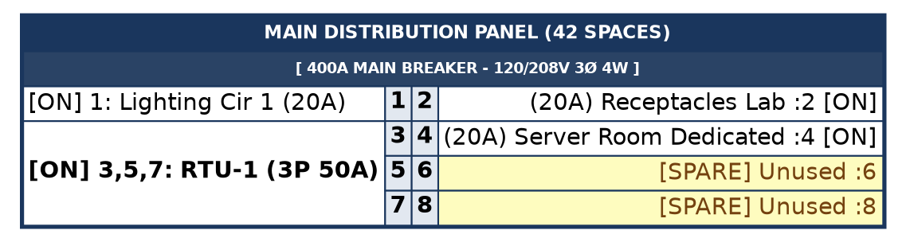

# JEMBY DIGITAL TWIN: Panel Sizing, Phase Rules, & DOT Layout Specification

This specification defines the deterministic sizing, phase allocation, multi-pole cell spanning, and Graphviz DOT table generation rules for commercial, industrial, and residential electrical panelboards.

---

## 1. Core Sizing Rules: Multiples of 6 & 12

Commercial and industrial panelboards (Square D NQ/NF, Siemens P1, Eaton Pow-R-Line, ABB/GE Pro-Stock) are **3-phase or split-phase panels arranged in 2 columns** (Odd circuits left, Even circuits right).

### 1.1 Standard Space Counts ($N$)
* **Standard Space Counts**:
  $$N \in \{18, 30, 42, 54, 72, 84\}$$
  *(Split-phase residential/light commercial may also use $N \in \{12, 24, 32, 40\}$).*
* **Total Row Count**:
  $$\text{Rows} = \frac{N}{2}$$

Every 3-phase commercial panel has a row count divisible by 3 (or an odd/even multiple) because it cycles continuously across the 3 phase pairs:
$$\text{Row Phase Pairs: } (A, A), (B, B), (C, C), (A, A), (B, B), (C, C), \dots$$

### 1.2 Digital Twin Auto-Sizing Algorithm
Given a set of required branch loads requiring $P_{\text{used}}$ total breaker poles:
1. **Target Sizing with Growth Buffer**: Calculate target spaces with a minimum 20% growth buffer:
   $$N_{\text{target}} \ge P_{\text{used}} \times 1.20$$
2. **Standard Frame Selection**: Select the smallest standard enclosure space count:
   $$N = \min \{ s \in \{18, 30, 42, 54, 72, 84\} \mid s \ge N_{\text{target}} \}$$
3. **Spare Auto-Fill**: Any unassigned slots from $P_{\text{used}} + 1 \dots N$ are automatically instantiated as `[SPARE]` entries.

---

## 2. Phase Staggering & Multi-Pole Ganging Rules

### 2.1 3-Phase Panel Bus Stab Alternation (208Y/120V & 480Y/277V)

```
       LEFT (ODD)                 RIGHT (EVEN)
   ┌────────────────┐         ┌────────────────┐
   │  Slot 1  (A)   │ ──(A)── │  Slot 2  (A)   │  (Row 1)
   ├────────────────┤         ├────────────────┤
   │  Slot 3  (B)   │ ──(B)── │  Slot 4  (B)   │  (Row 2)
   ├────────────────┤         ├────────────────┤
   │  Slot 5  (C)   │ ──(C)── │  Slot 6  (C)   │  (Row 3)
   ├────────────────┤         ├────────────────┤
   │  Slot 7  (A)   │ ──(A)── │  Slot 8  (A)   │  (Row 4)
   └────────────────┘         └────────────────┘
```

| Row Number | Left Pole (Odd) | Right Pole (Even) | Bus Phase | Phase Voltage ($V_{L-N}$) | Line-to-Line ($V_{L-L}$) |
|:---:|:---:|:---:|:---:|:---:|:---:|
| **Row 1** | Slot 1 | Slot 2 | **Phase A** | 120V / 277V | 208V / 480V |
| **Row 2** | Slot 3 | Slot 4 | **Phase B** | 120V / 277V | 208V / 480V |
| **Row 3** | Slot 5 | Slot 6 | **Phase C** | 120V / 277V | 208V / 480V |
| **Row 4** | Slot 7 | Slot 8 | **Phase A** | 120V / 277V | 208V / 480V |
| **Row 5** | Slot 9 | Slot 10 | **Phase B** | 120V / 277V | 208V / 480V |
| **Row 6** | Slot 11 | Slot 12 | **Phase C** | 120V / 277V | 208V / 480V |

### 2.2 Split-Phase Panel Bus Stab Alternation (120/240V 1-Phase 3-Wire)
For single-phase systems, rows alternate strictly between Phase A and Phase B:
$$\text{Row } r \implies \text{Phase } A \text{ if } r \text{ is odd, else Phase } B$$

### 2.3 Multi-Pole Breaker Ganging & Cell Spanning Rules
* **1-Pole Breaker (120V / 277V)**: Occupies 1 slot cell (e.g., Slot 1). Connected to 1 phase stab.
* **2-Pole Breaker (208V / 240V / 480V)**: Occupies 2 vertically adjacent slots on the same side (e.g., Slots 13 & 15 on Left, or 14 & 16 on Right).
  * **Table Render**: The load description cell uses `ROWSPAN="2"` starting at the top slot.
  * **Numeric Slots**: Both numeric slot IDs (e.g. 13 and 15) render in their respective rows.
  * **Phase Spanning**: Spans Phase A + B, Phase B + C, or Phase C + A.
* **3-Pole Breaker (208V 3Ø / 480V 3Ø)**: Occupies 3 vertically adjacent slots on the same side (e.g., Slots 1, 3, 5 or 2, 4, 6).
  * **Table Render**: The load description cell uses `ROWSPAN="3"` starting at the first slot.
  * **Numeric Slots**: All 3 numeric slot IDs render in their respective rows.
  * **Phase Spanning**: Spans Phase A + B + C across all three bus stabs.

---

## 3. Graphviz HTML Table Specification

### 3.1 Table Schema Architecture
The central panel node is rendered as an HTML-like table record with 4 principal columns:
1. **Column 1 (`LEFT_LOAD`)**: Left Breaker status, circuit name, and rating (with `ROWSPAN` for multi-pole).
2. **Column 2 (`LEFT_NUM`)**: Left Slot Number (Odd: $1, 3, 5, \dots$).
3. **Column 3 (`RIGHT_NUM`)**: Right Slot Number (Even: $2, 4, 6, \dots$).
4. **Column 4 (`RIGHT_LOAD`)**: Right Breaker status, circuit name, and rating (with `ROWSPAN` for multi-pole).

### 3.2 Visual Styling Tokens
* **Panel Enclosure Border**: `COLOR="#1A365D"`, `BORDER="2"`, `CELLBORDER="1"`, `CELLSPACING="0"`.
* **Primary Header (Panel Title)**: `BGCOLOR="#1A365D"`, `<FONT COLOR="WHITE"><B>... (N SPACES)</B></FONT>`.
* **Secondary Header (Mains Rating)**: `BGCOLOR="#2A4365"`, `<FONT COLOR="WHITE"><B>[ 400A MCB - 120/208V 3Ø 4W ]</B></FONT>`.
* **Numeric Slot Columns**: `BGCOLOR="#E2E8F0"`, `<B>1</B>`, `<B>2</B>`.
* **Active Breakers (`[ON]`)**: Standard background (`#FFFFFF`), bold slot tag, trip rating in parentheses.
* **Spare Slots (`[SPARE]`)**: Highlight background `BGCOLOR="#FEFCBF"`, `<FONT COLOR="#744210">[SPARE] Unused :N</FONT>`.
* **Spaces (`[SPACE]`)**: Highlight background `BGCOLOR="#F1F5F9"`, `<FONT COLOR="#94A3B8">[SPACE] Blank</FONT>`.

### 3.3 Reference DOT Syntax



---

## 4. Generator Prompt Directive

> *"For commercial and industrial panel twins, constrain total circuit spaces $N$ strictly to $\{18, 30, 42, 54, 72, 84\}$. Model the interior schedule as an $N/2$-row two-column array (odd circuits left, even circuits right). Group multi-pole loads using vertical cell spanning (`ROWSPAN=2` or `ROWSPAN=3` on the load column) while always rendering all numeric pole IDs (1 to $N$). Render unoccupied slots with a yellow highlight (`#FEFCBF`) marked `[SPARE]`."*
