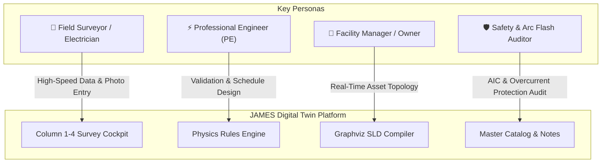
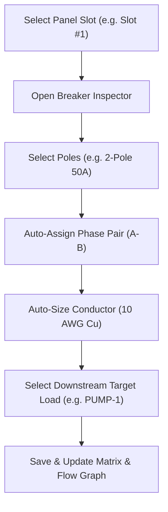
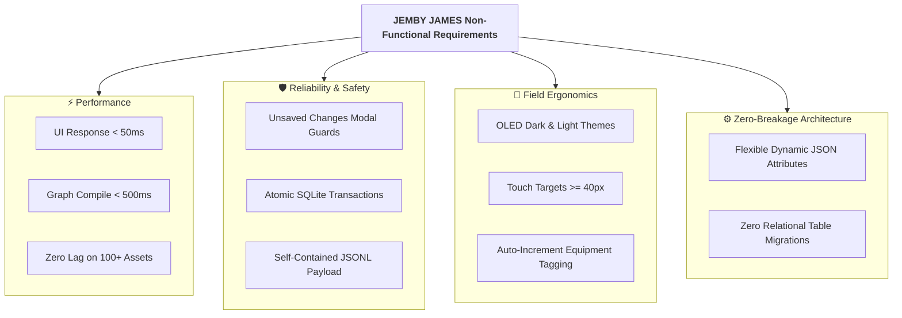
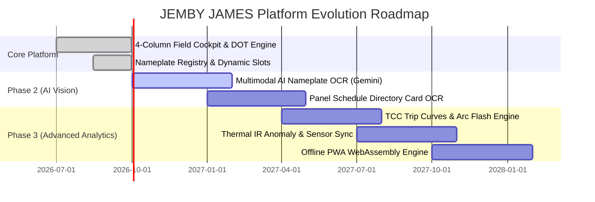

# Product Requirements Document (PRD)
# JEMBY JAMES Electrical Digital Twin Platform
**Next-Generation Physics-Aware Electrical Power Distribution Modeling, Field Survey Cockpit, & Single-Line Diagram Engine**

---

| Document Info | Details |
| :--- | :--- |
| **Product Name** | JEMBY JAMES Electrical Digital Twin (JAMES) |
| **Document Version** | 1.1.0 |
| **Document Status** | Approved & Implemented (Master Catalog Studio & Operations Telemetry) |
| **Target Audience** | Engineering Leadership, Field Surveyors, Electrical Engineers, Product Managers |
| **Author** | JEMBY Solutions / Google Antigravity Architecture Team |
| **Date** | September 2026 |

---

## 1. Executive Summary & Product Vision

### 1.1 Mission Statement
The **JEMBY JAMES Electrical Digital Twin** is an intelligent, physics-grounded modeling platform that digitizes industrial and commercial electrical power distribution systems. It bridges the critical gap between field survey data collection, deterministic electrical engineering physics, multi-scale schematic visualization, and AI-assisted facility optimization.

### 1.2 The Problem
Traditional electrical facility management and electrical study workflows suffer from systemic inefficiencies:
1. **Error-Prone Manual Surveys**: Field engineers rely on paper clipboards, disconnected spreadsheets, and fragmented smartphone photos to capture complex panel schedules, switchgear nameplates, and feeder paths.
2. **Static, Disconnected CAD Tools**: Legacy tools (AutoCAD, Visio, PDF one-lines) treat electrical drawings as dumb lines and text annotations. They possess zero understanding of electrical physics, upstream power flow, phase sequencing, or breaker ampacity constraints.
3. **Rigid Database Schemas**: Electrical equipment exhibits hundreds of manufacturer-specific parameters (e.g. `%Z` for transformers, fuel controllers for generators, bypass-isolation for transfer switches). Rigid relational database schemas break whenever novel field equipment is surveyed.
4. **High Latency from Survey to Single-Line Diagram (SLD)**: Transforming field survey notes into validated single-line diagrams takes weeks of tedious drafting and back-and-forth verification.

### 1.3 The Solution
JAMES delivers a unified, high-speed **4-Column Field Collector Cockpit** and a **Deterministic Graph Engine**:
* **High-Speed Touch-Optimized Surveying**: Rapid equipment instantiation with pre-populated engineering defaults across 10 equipment domains.
* **Dual-Column Panel Schedule Matrix**: Interactive breaker-slot management with automatic phase calculation (A/B/C for 3-phase, A/B for 1-phase) and multi-pole ganged breaker row spans.
* **Contextual Dynamic Attributes (`vendor_attrs`)**: Context-aware nameplate inputs tailored to equipment archetypes, paired with an ad-hoc custom attribute slot for instant on-site adaptability.
* **Zero-Friction Photo & Note Capture**: Instant nameplate and observation photo capture (camera, gallery, drag-and-drop, clipboard paste) stored as self-contained payloads in SQLite and companion `.jsonl`.
* **Automated Multi-Scale SLD Generation**: Dynamic Graphviz DOT compiler that renders facility power flow graphs using cluster subgraphs, discrete rectangular port terminals, and polyline routing.

---

## 2. User Personas & Core Use Cases



### 2.1 Personas
1. **Field Electrical Surveyor (Primary)**: Needs to document complex electrical rooms in noisy, low-connectivity environments at maximum speed. Values keyboard shortcuts, big touch targets, auto-incrementing tags, and zero lost data.
2. **Professional Electrical Engineer / Designer**: Audits field data, validates transformer sizing, configures panel schedules, and exports single-line schematics for permits and studies.
3. **Facility Manager / Data Center Operator**: Uses the digital twin for real-time asset tracking, upstream power tracing (e.g., "Which breaker feeds Server Rack 12?"), and maintenance planning.
4. **Safety & Compliance Auditor (NFPA 70E / NEC)**: Inspects equipment AIC ratings, conductor ampacity compliance, and working space clearances.

### 2.2 Primary User Flows
* **Use Case 1: Rapid Electrical Room Survey**: Surveyor creates a Main Distribution Panel (`MDP-1`), selects 480V 3Ø, populates 42 slots in minutes, attaches a nameplate photo, and defines upstream utility feeds.
* **Use Case 2: Multi-Scale Single-Line Visualization**: Engineer navigates from high-level facility power flow to drill down into a specific panel's internal breakers and downstream loads.
* **Use Case 3: Offline Data Export & Import**: System automatically persists to localized SQLite (`model.db`) and exports companion `.jsonl` for cloud ingestion and team sharing.

---

## 3. Product Architecture & Technical Specifications

JAMES implements a decoupled **Data-Physics-Visualization Triad**:

```mermaid
flowchart LR
    subgraph Frontend["Frontend Layer (SPA / Cockpit & Catalog Studio)"]
        UI1["Tailwind CSS 3.4 (Dark/Light)"]
        UI2["Alpine.js 3.14 (Reactive State)"]
        UI3["HTMX 2.0 (Dynamic Partials)"]
        UI4["D3-Graphviz (WASM Graph Engine)"]
    end

    subgraph Backend["Backend Layer (FastAPI)"]
        API["FastAPI 0.110 (Async REST)"]
        COMP["DOT Graph Compiler (dot_compiler.py)"]
        CAT["Master Catalog Engine (master_catalog.py)"]
        RULES["Deterministic Physics & Rules Engine"]
    end

    subgraph Storage["Persistence Layer"]
        SQL["Facility DB (SQLite model.db)"]
        CAT_DB["Master Catalog (SQLite master_catalog.db)"]
        JSONL["Companion model.jsonl & data/catalog/*.json"]
    end

    Frontend <-->|JSON REST & WebSockets| Backend
    Backend <-->|CRUD & Sync| Storage
```



### 3.1 Technology Stack Table

| Component | Technology | Version | Purpose |
| :--- | :--- | :--- | :--- |
| **Backend Framework** | Python / FastAPI | 3.11+ / 0.110 | Asynchronous REST API, Graph Engine, Data Validation |
| **Data Validation** | Pydantic | 2.6+ | Strongly-typed electrical twin data models |
| **Master Catalog Engine** | SQLite 3 / B-Tree Indexing | 3.40+ | High-performance catalog registry with JSON auto-sync |
| **Client Storage** | SQLite + JSONL | SQLite 3 | Zero-config localized relational & line-delimited storage |
| **Frontend Framework** | Alpine.js | 3.14+ | Lightweight reactive state management |
| **Styling Engine** | Tailwind CSS | 3.4+ | Utility-first responsive design, dark mode, glassmorphism |
| **Dynamic Interactivity**| HTMX | 2.0+ | Server-driven UI updates and partial swapping |
| **Graph Visualization** | Graphviz + D3-Graphviz | WASM | SVG rendering of single-line diagrams with pan/zoom |

---

---

## 4. Functional Requirements (FR)

### 4.0 User Interface Architecture & Visual Layout


*Figure 4.1: Production UI of the JEMBY JAMES 4-Column Field Collector Cockpit showing Domains (Col 1), Type Catalog (Col 2), Nameplate Form & Dynamic Specifications (Col 3), and Facility Stack with Grouping Modes (Col 4).*

---

### FR-1: 4-Column Resizable Survey Cockpit
* **FR-1.1 Four-Column Layout**:
  * **Column 1 (Equipment Domains)**: 10 categorized electrical domains (*Power Sources, Transformers, Switches & ATS, Panelboards & MCC, Power Quality & UPS, Electrical Loads, Conductors & Feeders, Meters & Monitors, Solar & Renewables, Generic / Unclassified*).
  * **Column 2 (Type Catalog)**: Archetype catalog with pre-configured ratings (e.g., `LP`, `MDP`, `MCC`, `REC`, `GEN`, `XFMR`, `ATS`, `MTS`, `DISC`, `UPS`, `HVAC`, `MOTOR`, `BESS`).
  * **Column 3 (Form & Schedule Editor)**: Physical ratings, Nameplate OEM registry, contextual dynamic slots, live NEC continuous load sizing, interactive dual-column panel schedule, and field observation notes.
  * **Column 4 (Facility Stack & Flow Tree)**: Grouped list of surveyed assets with real-time search filtering, status pills, and action controls.
* **FR-1.2 Top Master Control Bar**:
  * **Facility Context**: Displays current multi-tenant client and facility identifiers (e.g., `ZOETIS / B4 Field Survey`).
  * **Telemetry Metric Badges**: Real-time asset counter (`Total Stack: N Assets`), cumulative service entrance capacity (`Total Mains: N A`), and persistence health (`Status: Auto-Saved`).
  * **Global Actions**:
    * `Hide/Show Catalog` toggle to expand the central editing canvas on laptop screens.
    * `Field Guide` modal trigger (`?` shortcut).
    * `Dark Mode` / `Light Mode` instant theme switch.
    * `Export JSONL` button to download streaming companion datasets.
    * `⚡ View SLD Diagram` CTA button to instantly transition into the interactive graph visualizer.
* **FR-1.3 Stack Grouping Modes (Column 4)**:
  * **Room Grouping (`Room`)**: Groups equipment by physical location (e.g., `🏢 Level 1 - Main Electric Room 101`, `🏢 Rooftop HVAC Penthouse`).
  * **Upstream Tree Grouping (`Tree`)**: Renders hierarchical power flow relationships from utility/generator feeds down to branch subpanels.
  * **Type Grouping (`Type`)**: Categorizes assets by equipment classification.
* **FR-1.4 Splitter Resizing**: All column splitters shall support smooth, touch-friendly horizontal dragging with persisted width states.

### FR-2: Nameplate, OEM & Asset Registry
* **FR-2.1 OEM & Catalog Metadata**:
  * `Manufacturer / OEM` (with datalist autocomplete for major brands: *Square D / Schneider Electric, Eaton / Cutler-Hammer, Siemens, ABB / GE, ASCO Power Technologies, Caterpillar, Cummins, Kohler, Vertiv / Liebert, Olsun Electrics*)
  * `Catalog / Model #`
  * `Client Asset Tag`
  * `Serial Number (Optional)`
  * `Year Commissioned`
  * `Mounting Environment` (*Surface Wall Mount, Flush Recessed, Free-Standing Pad, Skid / Unit Substation*)
* **FR-2.2 Dedicated Nameplate Photo Slot**:
  * Integrated nameplate image upload supporting Camera, File Picker, Drag & Drop, and Clipboard Paste.
  * Displays thumbnail card with click-to-zoom Lightbox and deletion badge.

### FR-3: Dynamic Equipment Specifications & Ad-Hoc Attributes
* **FR-3.1 Contextual Slots by Archetype**:
  * **Generators (`GEN`)**: Standby/Prime kW rating, Fuel Type (*Diesel #2, Natural Gas, Propane, Dual Fuel*), Engine Controller (*e.g., EMCP 4.2B*).
  * **Transformers (`XFMR` / `PAD`)**: Impedance (`%Z`), Temp Rise (*150°C, 115°C Low Loss, 80°C*), Cooling Class (*AA, FA, ONAN*).
  * **Transfer Switches (`ATS` / `MTS`)**: Transition Mode (*Open Transition, Closed Transition / Soft-Load, Delayed Transition*), Bypass Isolation (*No Bypass, Dual Drawout Bypass*), Controller Logic (*e.g., Group G Controller*).
  * **Safety Disconnect Switches (`DISC`)**: Fuse Class (*Class J, Class R, Class T, Class L, Class CC, Non-Fused*), Installed Fuse Amps, Blown Fuse Indicators (*Yes/No*).
* **FR-3.2 Ad-Hoc Nameplate Extensibility (`➕ Add Field Attribute`)**:
  * Provides on-the-fly creation of arbitrary `Parameter Name : Value` pairs for rare field equipment.
  * Scoped to that asset instance and saved inside `attributes.vendor_attrs` without schema migrations.

### FR-4: Real-Time Live NEC Calculations
* **FR-4.1 Continuous Load Sizing (NEC 125% Rule)**:
  * Automatically calculates Full Load Amps (`Calculated FLA`).
  * Computes minimum Overcurrent Protection Device rating: `OCPD_min = 1.25 × FLA`.
  * Auto-recommends minimum copper feeder conductor gauge (e.g., `125% OCPD Min: 500 A` → `Min Cu Conductor: 500 kcmil Cu`).

### FR-5: Dual-Column Panel Schedule Matrix
* **FR-5.1 Physical Slot Configuration**:
  * Supports standard panel sizes (12, 18, 24, 30, 42, 54, 72, 84 slots).
  * Auto-calculates electrical phase:
    * 3-Phase Panels: Cycle sequence A → B → C → A ... (Phases color-coded: A=Red, B=Blue, C=Emerald).
    * 1-Phase Panels: Alternating A → B → A ...
* **FR-5.2 Breaker Inspector Modal**:
  * Clicking any slot opens the inspector modal to configure: Circuit Description, Trip Amps (15A–1200A), Poles (1P, 2P, 3P), Type (*MCCB, Miniature, AFCI, GFCI, MCP, Drawout*), Wire Gauge (auto-computed from ampacity), and Downstream Target Load.
  * **Multi-Pole Ganging**: Setting 2-pole or 3-pole automatically locks and groups sequential phase rows with multi-row span indicators.
  * **One-Click Space Conversion**: `Remove Breaker` button clears slot to Space/Spare.



### FR-6: Field Notes, Observations & Photo Attachments
* **FR-6.1 Multi-Input Capture**: Camera snaps, device gallery multi-upload, drag & drop, and clipboard paste (`Cmd+V` / `Ctrl+V`).
* **FR-6.2 Auto-Flush Safety**: If a surveyor attaches photos or types an observation and immediately hits **"💾 Save Asset"** without clicking "Add", the system automatically flushes the staged content directly into the asset's permanent notes.
* **FR-6.3 Fullscreen Lightbox Modal**: High-resolution zoomable viewer with photo timestamp, caption, and download button.

### FR-7: Multi-Scale Graphviz Single-Line Diagram Engine
* **FR-7.1 10-Domain Harmonized Pastel Palette**:
  * Equipment clusters are color-coded by electrical domain with high-contrast pastel background fills, distinct border outlines, and dark slate typography (`#0F172A`):
    * **Power Sources (`sources`)**: Amber (`#FEF3C7` / `#D97706`)
    * **Transformers (`transformers`)**: Purple (`#F3E8FF` / `#9333EA`)
    * **Switches & ATS (`switches`)**: Royal Blue (`#DBEAFE` / `#2563EB`)
    * **Panelboards & MCC (`panels`)**: Slate / Indigo (`#F1F5F9` / `#475569`)
    * **Power Quality & UPS (`power_quality`)**: Emerald (`#D1FAE5` / `#059669`)
    * **Loads & Chillers (`loads`)**: Teal (`#CCFBF1` / `#0D9488`)
    * **Feeders & Busway (`cables`)**: Orange (`#FFEDD5` / `#EA580C`)
    * **Meters & Monitors (`metering`)**: Sky (`#E0F2FE` / `#0284C7`)
    * **Solar & Renewables (`renewables`)**: Yellow (`#FEF9C3` / `#CA8A04`)
    * **Generic / Assets (`generic`)**: Slate (`#F8FAFC` / `#64748B`)
* **FR-7.2 Silver Blueprint Drafting Canvas**:
  * The Single-Line Diagram viewport renders over an architectural silver metallic drafting canvas (`#CBD5E1`) featuring a subtle dot grid matrix for maximum line contrast and drawing clarity.
* **FR-7.3 Discrete Port Terminals & Dedicated Slot Numbering**:
  * Connections terminate at physical rectangular ports (`fillcolor="#334155"`, `fontcolor="#FFFFFF"`).
  * Circuit breaker and feeder slots feature a dedicated top-row physical slot tag:
    * **Line 1**: `[ Slot 1 ]` *(Physical Slot / Position ID)*
    * **Line 2**: `Server Rack 1A` *(Circuit / Load Description)*
    * **Line 3**: `50A` *(Breaker Trip Rating)*
* **FR-7.4 Orthogonal Polyline Routing & Dark Feeder Lines**:
  * Feeder runs are routed with `splines=polyline` in bold dark slate (`#0F172A`, `penwidth=2.0`), with emergency standby generator feeds highlighted in safety amber (`#B45309`, `penwidth=2.2`).
* **FR-7.5 Interactive Domain Legend & Active Highlighting**:
  * Persistent pill bar docked at the viewport base providing live badge counts for every equipment domain present in the active single-line schematic.
  * Clicking any domain legend button dynamically highlights and isolates all matching equipment nodes on the canvas.
* **FR-7.6 Compact Multi-Line Box Formatting**:
  * Equipment boxes display voltage, amperage, and slot counts formatted across compact secondary and tertiary lines to minimize node width and optimize schematic routing density.

---

### FR-8: Master Equipment Catalog Engine & Catalog Studio (`/catalog`)
* **FR-8.1 Multi-Manufacturer SQLite Storage Engine (`data/master_catalog.db`)**:
  * High-performance relational catalog indexing over 280+ certified equipment parts and UPCs across 9 major manufacturers:
    * **Eaton** (Power Defense MCCB Frames 1–6, Safety Switches, Meter Centers, V48M Transformers)
    * **Square D / Schneider Electric** (EE Series Low Voltage Dry-Type Transformers 75–225 kVA)
    * **Siemens** (Standard Ventilated Low-Voltage Dry-Type Transformers)
    * **Bussmann** (Low-Peak & Fusetron Industrial Class J/CC/RK5 Fuses with UPCs)
    * **Generac Power Systems** (Guardian Standby Generators & Automatic Transfer Switches with UPCs)
    * **Leviton** (Industrial Spec-Grade Receptacles & Locking Plugs with UPCs)
    * **Southwire** (SIMpull THHN & XHHW-2 Copper Building Wire with UPCs)
    * **Allied Tube & Conduit** (True Color EMT & Galvanized Steel Conduit with UPCs)
    * **Cooper Lighting Solutions** (Commercial & Industrial LED Fixtures with UPCs)
* **FR-8.2 Full-Screen Catalog Studio Web Application (`/catalog`)**:
  * Dedicated desktop catalog management dashboard featuring:
    * Real-time search with instant debounce across part numbers, descriptions, series, and barcodes.
    * Multi-filter sidebar (Domain, Archetype, Manufacturer with live counts).
    * Slide-Over Specification Drawer for creating and editing electrical ratings, dimensions, and cut-sheet URLs.
    * **1-Click Part Cloning (`📋 Clone`)**: Rapidly duplicates existing parts with custom amperages or kVA ratings.
    * **Bulk Import & Export**: 1-click JSON / CSV upload and download.
* **FR-8.3 Cascading Auto-Fill in Field Cockpit**:
  * In Column 3 (Inspector) and the Breaker Modal, selecting an OEM dynamically filters available part numbers and auto-populates voltage, amps, AIC, kVA, total slots, enclosure ratings, and UPC codes with a green **`⚡ Catalog Verified`** badge.
* **FR-8.4 Bi-Directional Git Sync**:
  * Automatically syncs all SQLite database mutations to human-readable `data/catalog/{manufacturer}.json` files for Git versioning.

---

### FR-9: Operations, Asset Health & Safety Telemetry
* **FR-9.1 Asset Criticality & Condition Assessment**:
  * **Operational Criticality**: (1 - High / Life Safety & Data Center, 2 - Medium / Production, 3 - Low / Non-Essential).
  * **Physical Condition Rating**: (1 - Excellent / As-New, 2 - Good / Operational, 3 - Degraded / Action Required).
  * **Operating Environment**: (Indoor Conditioned, NEMA 3R Outdoor, Harsh / Chemical, Damp).
* **FR-9.2 Maintenance & Inspection Scheduling**:
  * Configurable inspection intervals (*Quarterly, Semi-Annual, Annual, 3-Year, 5-Year*) with automated Next Due Date computation and overdue alerting.
* **FR-9.3 Arc Flash Safety & Incident Energy Compliance**:
  * Logging for Arc Flash Hazard Category (0 to 4) and Incident Energy ratings ($cal/cm^2$).
* **FR-9.4 Field Diagnostic Telemetry Logs**:
  * **Infrared Thermography**: Visual hot-spot detection, delta-T logging, and pass/fail tagging.
  * **Torque Verification**: Lug tightening checks verified against manufacturer specifications (in-lbs / ft-lbs).
  * **Insulation Resistance (Megger)**: Phase-to-phase and phase-to-ground resistance measurements ($M\Omega$).

---

## 5. Non-Functional Requirements (NFR)



### 5.1 Performance & Responsiveness
* **NFR-1.1**: The Cockpit UI shall respond to user input in under **50 milliseconds**.
* **NFR-1.2**: Full facility DOT graph compilation and SVG rendering shall complete in under **500 milliseconds** for facilities with up to 250 assets.
* **NFR-1.3**: The client application bundle shall operate with zero external npm build-step dependencies when running standalone.

### 5.2 Reliability & Data Integrity
* **NFR-2.1**: **Unsaved Changes Safety Guard**: Any attempt to switch equipment domains, select a new type, or navigate away while uncommitted edits or staged photos exist shall trigger an explicit confirmation modal (*Save & Switch, Discard, Keep Editing*).
* **NFR-2.2 Unique Tag Enforcement**: The system shall validate equipment tags in real-time and prevent duplicate tags within the same facility.
* **NFR-2.3 Electrical Cycle Prevention**: The upstream `Fed From` selector shall automatically filter out self, downstream descendants, and incompatible source domains to prevent physical power flow loops.

### 5.3 Usability & Field Ergonomics
* **NFR-3.1**: Support high-contrast **OLED Dark Mode** (for dimly lit electrical rooms) and **Clean Light Mode** (for bright outdoor substations), with automatic persistence.
* **NFR-3.2**: Minimum interactive touch target size of **40 × 40 px** across all mobile and tablet inputs.
* **NFR-3.3**: Keyboard shortcuts: `?` toggles Field Survey Help Modal, `Enter` saves/adds notes and breakers, `Esc` dismisses modals.

---

## 6. Data Model & Schema Specification

### 6.1 Unified Node Schema (`DigitalTwinNode`)

```json
{
  "id": "s_1788691000",
  "tag": "MDP-1",
  "name": "Main Distribution Panel",
  "domain": "panels",
  "type_tag": "MDP",
  "type_name": "Main Distribution Panel (MDP)",
  "room": "Main Electrical Room 101",
  "fed_from": "ATS-1",
  "voltage": "480Y/277V 3Ø 4W",
  "amps": 1200.0,
  "aic": 65.0,
  "is_panel": 1,
  "slots": 42,
  "survey_sequence": 1,
  "attributes": {
    "manufacturer": "Square D / Schneider Electric",
    "model_no": "QED-2",
    "asset_tag": "AST-ZOETIS-0042",
    "serial_no": "SN-894021-B",
    "year_installed": 2018,
    "mounting": "Freestanding",
    "main_type": "MCB",
    "nameplate_photo": {
      "id": "photo_1788691001",
      "name": "MDP1_Nameplate.jpg",
      "dataUrl": "data:image/jpeg;base64,...",
      "timestamp": "10:45 AM"
    },
    "vendor_attrs": {
      "section_type": "Main + Distribution",
      "main_device": "PowerPact P-Frame",
      "bus_bracing_ka": 65
    },
    "schedule": [
      {
        "leftSlot": 1,
        "leftDesc": "Server Rack 1A",
        "leftTrip": "50",
        "leftPoles": 2,
        "leftType": "MCCB",
        "leftWire": "10 AWG Cu",
        "leftTargetLoad": "PDU-1",
        "phase": "A",
        "phaseColor": "text-red-500",
        "rightSlot": 2,
        "rightDesc": "HVAC Fan 1",
        "rightTrip": "20",
        "rightPoles": 1,
        "rightType": "MCCB",
        "rightWire": "12 AWG Cu",
        "rightTargetLoad": "CH-1"
      }
    ],
    "notes": [
      {
        "id": "note_1788691002",
        "text": "Infrared scan completed. Lugs torqued to 275 in-lbs.",
        "date": "09/06 10:45",
        "author": "Field Survey",
        "photos": []
      }
    ]
  }
}
```

---

## 7. REST API Endpoints

| Method | Endpoint | Description |
| :--- | :--- | :--- |
| `GET` | `/cockpit` | Serves the interactive 4-Column Field Collector Cockpit |
| `GET` | `/catalog` | Serves the full Master Catalog Studio UI for equipment management |
| `GET` | `/clients/{client}/facilities/{facility}/sld` | Serves the interactive Single-Line Diagram viewer |
| `GET` | `/api/clients/{client}/facilities/{facility}/nodes` | Retrieves all equipment nodes from client-isolated SQLite DB |
| `POST` | `/api/clients/{client}/facilities/{facility}/nodes` | Upserts an asset node (with schedule, telemetry, photos, & dynamic attrs) |
| `DELETE` | `/api/clients/{client}/facilities/{facility}/nodes/{id}`| Deletes an asset node and cleans up downstream references |
| `GET` | `/api/clients/{client}/facilities/{facility}/dot` | Compiles facility digital twin graph to Graphviz DOT string |
| `GET` | `/api/catalog/stats` | Summary statistics and counts across all Master Catalog equipment |
| `GET` | `/api/catalog/manufacturers` | List of manufacturers supporting selected domain/type |
| `GET` | `/api/catalog/items` | Filtered list of equipment parts with pagination and search |
| `GET` | `/api/catalog/items/{part_number}` | Retrieves single item specification and barcode data |
| `POST` | `/api/catalog/items` | Creates a new catalog item and persists to SQLite & JSON |
| `PUT` | `/api/catalog/items/{part_number}` | Updates an existing catalog item with live sync |
| `DELETE` | `/api/catalog/items/{part_number}` | Deletes an item from the Master Catalog |
| `POST` | `/api/catalog/clone/{part_number}` | Clones an existing part into a new variant with overrides |
| `POST` | `/api/catalog/import` | Bulk imports items from JSON/CSV payload with overwrite safety |
| `GET` | `/api/catalog/export` | Exports catalog items as structured CSV or JSON |

---

## 8. Strategic Roadmap & AI Futures



* **Phase 2.1**: **Multimodal AI Nameplate OCR** (Gemini 2.5 Flash agent extracts voltage, amps, AIC, model, and serial directly from photos).
* **Phase 2.2**: **Panel Directory OCR** (Digitizes paper directory cards into dual-column schedule matrix automatically).
* **Phase 3.1**: **Parametric TCC Curves & Selective Coordination** (Mathematical breaker trip curves and arc-flash clearing time estimation).
* **Phase 3.2**: **Thermal IR Integration** (Attaching FLIR radiometric images to breaker slots to flag hot spots).
* **Phase 3.3**: **Offline PWA** (Client-side WASM SQLite sync for zero-connectivity environments).

---

## 9. Success Metrics & Key Performance Indicators (KPIs)

1. **Survey Velocity**: Reduce total on-site data capture and nameplate logging time by **> 65%**.
2. **SLD Turnaround Time**: Accelerate draft Single-Line Diagram generation from **2–3 weeks to instant real-time compilation**.
3. **Data Completeness**: Achieve **100% asset nameplate capture** including photos and dynamic vendor parameters.
4. **Schema Stability**: **Zero database schema migrations** required when adding new equipment types or vendor attributes.
5. **Test Coverage**: Maintain **> 95% test coverage** across all core physics rules, DOT compilers, and API routes.
