```markdown
# Product & Technical Specification: Interactive Electrical Single-Line Diagram (SLD) Builder

## 1. System Overview & Architecture
Build an interactive, web-based Electrical Single-Line Diagram (SLD) and Asset Management tool. The system allows users to define building projects, instantiate electrical equipment from a schema-driven Master Catalog, configure attributes via dynamic forms, define electrical connections/feeders, and render an interactive, hierarchical diagram in the browser.

### Tech Stack
* **Backend:** Python / FastAPI (REST endpoints, project persistence, dynamic schema validation).
* **Frontend:** HTMX (HTML-over-the-wire for UI state and modal forms) + Tailwind CSS (styling) + Alpine.js (local modal/drawer and canvas UI state).
* **Graph & Diagram Engine:** `d3-graphviz` (or `@viz-js/viz` standalone with `d3-zoom`) running directly in the browser via WebAssembly to render Graphviz DOT layouts with smooth pan/zoom and SVG DOM interactions.
* **Data Storage:** SQLite / JSON-backed file store (separating the static Master Catalog from project instances).

---

## 2. Master Catalog Data Model (JSON / Python Dict)
The Master Catalog defines available electrical equipment types, their categorization, and the metadata required to generate dynamic data entry forms.

```python
MASTER_CATALOG = {
    "SWBD": {
        "category": "Switchgear & Enclosures",
        "name": "Main / Distribution Switchboard",
        "symbol_code": "SWBD",
        "fields": {
            "bus_amps": {"type": "number", "label": "Bus Rating (A)", "default": 1200, "required": True},
            "voltage": {"type": "select", "label": "Nominal Voltage", "options": ["480/277V", "208/120V", "240/120V"], "required": True},
            "sccr_ka": {"type": "number", "label": "Short Circuit Rating (kA)", "default": 65.0},
            "neutral_rating_pct": {"type": "number", "label": "Neutral Rating (%)", "default": 100}
        }
    },
    "XFMR": {
        "category": "Transformation",
        "name": "Distribution Transformer",
        "symbol_code": "PT",
        "fields": {
            "kva": {"type": "number", "label": "kVA Rating", "default": 750, "required": True},
            "primary_v": {"type": "number", "label": "Primary Voltage (V)", "default": 12000, "required": True},
            "secondary_v": {"type": "number", "label": "Secondary Voltage (V)", "default": 480, "required": True},
            "impedance_pct": {"type": "number", "label": "Impedance (%Z)", "default": 5.75},
            "config": {"type": "select", "label": "Winding", "options": ["Delta-Wye Grounded", "Delta-Delta", "Wye-Wye"]}
        }
    },
    "ATS": {
        "category": "Switchgear & Enclosures",
        "name": "Automatic Transfer Switch",
        "symbol_code": "ATS",
        "fields": {
            "ampacity": {"type": "number", "label": "Rated Amps (A)", "default": 600, "required": True},
            "voltage": {"type": "select", "label": "Voltage", "options": ["480V", "208V", "240V"]},
            "poles": {"type": "select", "label": "Poles", "options": [3, 4], "default": 3}
        }
    },
    "PNL": {
        "category": "Distribution",
        "name": "Branch Circuit Panelboard",
        "symbol_code": "PNL",
        "fields": {
            "bus_amps": {"type": "number", "label": "Mains Rating (A)", "default": 225, "required": True},
            "voltage": {"type": "select", "label": "Voltage", "options": ["480/277V", "208/120V"], "required": True},
            "sccr_ka": {"type": "number", "label": "SCCR Rating (kA)", "default": 35.0},
            "mcb_or_mlo": {"type": "select", "label": "Main Type", "options": ["MCB", "MLO"], "default": "MCB"}
        }
    },
    "FEEDER_BREAKER": {
        "category": "Protection & Switching",
        "name": "Feeder Breaker / Disconnect",
        "symbol_code": "CB",
        "fields": {
            "frame_a": {"type": "number", "label": "Frame Rating (AF)", "default": 250},
            "trip_a": {"type": "number", "label": "Trip Setting (AT)", "default": 200, "required": True},
            "cable_size": {"type": "text", "label": "Conductor Size", "default": "4/0 Cu"},
            "conductors_per_phase": {"type": "number", "label": "Qty / Phase", "default": 1},
            "length_ft": {"type": "number", "label": "Run Length (ft)", "default": 50}
        }
    }
}

```

---

## 3. Project Instance & Graph Data Model

A project stores instances of equipment nodes and feeder edges.

```json
{
  "project_id": "zoetis_b4",
  "name": "Zoetis Building 4 - Power Distribution",
  "nodes": {
    "UTIL": { "type": "UTIL", "label": "PG&E Utility Grid", "data": { "voltage": "12kV", "duty_ka": 3.32 } },
    "XFMR_PGE": { "type": "XFMR", "label": "XFMR-PG&E", "data": { "kva": 750, "primary_v": 12000, "secondary_v": 480 } },
    "SWBD_MSA": { "type": "SWBD", "label": "SWBD-MSA", "data": { "bus_amps": 2000, "voltage": "480/277V", "sccr_ka": 65.0 } },
    "ATS_1": { "type": "ATS", "label": "ATS-1", "data": { "ampacity": 600, "voltage": "480V" } },
    "SWBD_MSB2": { "type": "SWBD", "label": "SWBD-MSB-2", "data": { "bus_amps": 1200, "voltage": "480V" } }
  },
  "edges": [
    {
      "id": "edge_util_xfmr",
      "from_node": "UTIL",
      "from_port": "out",
      "to_node": "XFMR_PGE",
      "to_port": "in",
      "data": { "fuse": "50E Fuse" }
    },
    {
      "id": "edge_xfmr_msa",
      "from_node": "XFMR_PGE",
      "from_port": "out",
      "to_node": "SWBD_MSA",
      "to_port": "in",
      "data": { "breaker": "CB-MAIN-MSA (2000A)" }
    },
    {
      "id": "edge_msa_ats",
      "from_node": "SWBD_MSA",
      "from_port": "p1",
      "to_node": "ATS_1",
      "to_port": "norm",
      "data": { "breaker": "CB-SWBD-MSB-2 (1000A)", "cable": "3x (3-400kcmil)" }
    }
  ]
}

```

---

## 4. DOT Generation Strategy

```dot
digraph SLD {
    graph [rankdir=TB, splines=ortho, nodesep=0.7, ranksep=0.7, fontname="Helvetica"];
    node [shape=plain, fontname="Helvetica", fontsize=9];
    edge [dir=none, penwidth=1.2, color="#1E293B", fontname="Helvetica", fontsize=8];

    SWBD_MSB2 [
        id="node_SWBD_MSB2",
        label=<
            <table border="0" cellborder="1" cellspacing="0" cellpadding="4" bgcolor="#F8FAFC" style="rounded">
                <tr><td colspan="3" bgcolor="#0F172A"><font color="white"><b>SWBD-MSB-2 (1200A, 480V)</b></font></td></tr>
                <tr>
                    <td port="p1" bgcolor="#E2E8F0" href="javascript:openFeederModal('CB-XFMR-T1')">CB-XFMR-T1<br/>450A</td>
                    <td port="p2" bgcolor="#E2E8F0" href="javascript:openFeederModal('CB-PNL-M1')">CB-PNL-M1<br/>400A</td>
                    <td port="p3" bgcolor="#E2E8F0" href="javascript:openFeederModal('CB-ATS-T1')">CB-ATS-T1<br/>600A</td>
                </tr>
            </table>
        >
    ];

    PNL_M1 [
        id="node_PNL_M1",
        label=<
            <table border="0" cellborder="1" cellspacing="0" cellpadding="4" bgcolor="#F8FAFC" style="rounded">
                <tr><td port="in" bgcolor="#334155"><font color="white"><b>PNL-M1 (400A, 480V)</b></font></td></tr>
                <tr><td>8x Mechanical Feeders</td></tr>
            </table>
        >
    ];

    SWBD_MSB2:p2:s -> PNL_M1:in:n [label=" 2x (3-4/0 Cu) | 2 ft", id="edge_msb2_pnlm1"];
}

```

FastAPI converts project topology into Graphviz DOT syntax using HTML tables with port identifiers (`<td port="...">`):



---

## 5. Frontend & UI Implementation

### Page Layout

1. **Left Sidebar:** Palette of equipment from the Master Catalog (drag/click to add to project).
2. **Main Canvas:** Full-viewport diagram rendered by `d3-graphviz` with pan, zoom, and SVG interaction.
3. **Right Drawer / Modal (HTMX):** Dynamic attribute form loaded via HTMX when clicking on nodes, ports, or edges.

### Browser Rendering Flow with `d3-graphviz`

```html
<div id="graph-viewport" class="w-full h-[85vh] bg-slate-50 border rounded-lg overflow-hidden shadow-inner"></div>

<!-- Slide-over Drawer for Dynamic Forms -->
<div id="editor-drawer" class="hidden fixed right-0 top-0 h-full w-96 bg-white shadow-xl border-l p-6 z-50">
    <div id="form-container">
        <!-- HTMX swaps dynamic form fields here -->
    </div>
</div>

<script src="[https://d3js.org/d3.v7.min.js](https://d3js.org/d3.v7.min.js)"></script>
<script src="[https://unpkg.com/@hpcc-js/wasm/index.min.js](https://unpkg.com/@hpcc-js/wasm/index.min.js)"></script>
<script src="[https://unpkg.com/d3-graphviz@5.1.0/build/d3-graphviz.min.js](https://unpkg.com/d3-graphviz@5.1.0/build/d3-graphviz.min.js)"></script>

<script>
    const graphviz = d3.select("#graph-viewport")
        .graphviz()
        .zoom(true)
        .fit(true);

    function renderDiagram(dotSource) {
        graphviz.renderDot(dotSource).on("end", () => {
            // Attach event listeners to SVG nodes for HTMX form loading
            d3.selectAll(".node").on("click", function() {
                const nodeId = this.id.replace("node_", "");
                htmx.ajax("GET", `/api/projects/zoetis_b4/nodes/${nodeId}/form`, { target: "#form-container" });
                document.getElementById("editor-drawer").classList.remove("hidden");
            });
        });
    }

    // Initial load: Fetch DOT string from FastAPI endpoint
    fetch('/api/projects/zoetis_b4/dot')
        .then(res => res.text())
        .then(dot => renderDiagram(dot));
</script>

```

---

## 6. Endpoints to Implement (FastAPI)

1. `GET /api/catalog` → Returns the static `MASTER_CATALOG` dictionary.
2. `GET /api/projects/{project_id}` → Returns the project graph JSON.
3. `GET /api/projects/{project_id}/dot` → Generates and returns the compiled Graphviz DOT string.
4. `GET /api/projects/{project_id}/nodes/{node_id}/form` → Returns an HTMX-rendered HTML form populated with the equipment's current data and catalog validation rules.
5. `POST /api/projects/{project_id}/nodes/{node_id}` → Saves updated form attributes and returns an HTMX trigger or updated DOT to re-render the canvas.
6. `POST /api/projects/{project_id}/edges` → Connects two node ports and updates the topology.

```

```