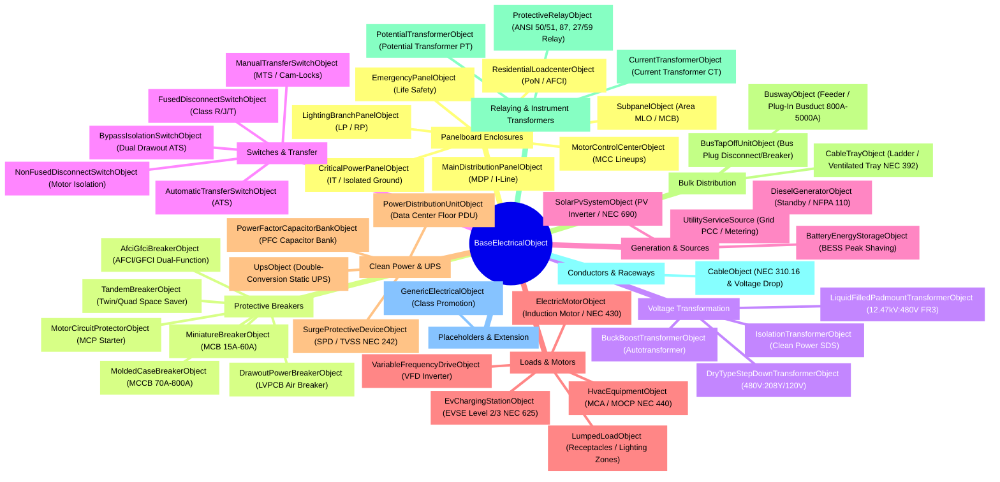

# JEMBY Digital Twin Object Specification Catalog

This directory contains individual technical specifications, physical layout rules, validation constraints, multi-view visual projection formats, and code examples for every Digital Twin object class in the JEMBY electrical modeling platform.

---

## 1. Complete Object Taxonomy & Mindmap

### Mermaid Class Mindmap

---

## 2. Directory Index

### Base Protocol
* [`BaseElectricalObject`](file:///Users/michaelcornelio/jemby/jemby_solutions/jemby_gcp/JAMES_Development/docs/objects/base/base_electrical_object.md) - Universal 5-Facet architectural foundation.

### Panelboards & Enclosures (`docs/objects/panels/`)
* [`PanelboardObject`](file:///Users/michaelcornelio/jemby/jemby_solutions/jemby_gcp/JAMES_Development/docs/objects/panels/base_panel.md) - Base panel enclosure with bus phase alternating arithmetic ($A, B, C$), multi-pole slot spanning, and $\ge 20\%$ spare capacity auto-sizing.
* [`MainDistributionPanelObject`](file:///Users/michaelcornelio/jemby/jemby_solutions/jemby_gcp/JAMES_Development/docs/objects/panels/main_distribution.md) - Main Distribution Panels (MDP / I-Line / CDP) for bulk 3-phase feeder distribution.
* [`LightingBranchPanelObject`](file:///Users/michaelcornelio/jemby/jemby_solutions/jemby_gcp/JAMES_Development/docs/objects/panels/lighting_branch.md) - Standard 120/208V & 277/480V commercial branch lighting & appliance panels.
* [`EmergencyPanelObject`](file:///Users/michaelcornelio/jemby/jemby_solutions/jemby_gcp/JAMES_Development/docs/objects/panels/emergency_panel.md) - NEC 700 / 701 Emergency & Life Safety dedicated enclosures.
* [`CriticalPowerPanelObject`](file:///Users/michaelcornelio/jemby/jemby_solutions/jemby_gcp/JAMES_Development/docs/objects/panels/critical_power.md) - Clean power data center/healthcare panels with TVSS / Isolated Ground.
* [`MotorControlCenterObject`](file:///Users/michaelcornelio/jemby/jemby_solutions/jemby_gcp/JAMES_Development/docs/objects/panels/motor_control.md) - Industrial MCC lineups with combination motor starter buckets.
* [`SubpanelObject`](file:///Users/michaelcornelio/jemby/jemby_solutions/jemby_gcp/JAMES_Development/docs/objects/panels/subpanel.md) - Secondary area distribution panelboards (MLO/MCB).
* [`ResidentialLoadcenterObject`](file:///Users/michaelcornelio/jemby/jemby_solutions/jemby_gcp/JAMES_Development/docs/objects/panels/residential.md) - Split-phase 120/240V dwelling loadcenters with Plug-on Neutral and AFCI/GFCI.

### Protective Devices & Breakers (`docs/objects/breakers/`)
* [`CircuitBreakerObject`](file:///Users/michaelcornelio/jemby/jemby_solutions/jemby_gcp/JAMES_Development/docs/objects/breakers/base_breaker.md) - Base embedded breaker with operational states (`ON`, `OFF`, `TRIPPED`, `SPARE`, `SPACE`) and phase connection terminals.
* [`MoldedCaseBreakerObject`](file:///Users/michaelcornelio/jemby/jemby_solutions/jemby_gcp/JAMES_Development/docs/objects/breakers/molded_case.md) - High-AIC commercial / industrial MCCB for heavy feeders ($70\text{A}-800\text{A}$).
* [`MiniatureBreakerObject`](file:///Users/michaelcornelio/jemby/jemby_solutions/jemby_gcp/JAMES_Development/docs/objects/breakers/miniature_breaker.md) - Standard 1-inch bolt-on / plug-on MCBs ($15\text{A}-60\text{A}$).
* [`AfciGfciBreakerObject`](file:///Users/michaelcornelio/jemby/jemby_solutions/jemby_gcp/JAMES_Development/docs/objects/breakers/afci_gfci.md) - Dual-function arc-fault and ground-fault personnel safety breakers (NEC 210.12 / 210.8).
* [`MotorCircuitProtectorObject`](file:///Users/michaelcornelio/jemby/jemby_solutions/jemby_gcp/JAMES_Development/docs/objects/breakers/motor_protector.md) - Instantaneous magnetic-only MCPs for motor starters (NEC 430.52).
* [`DrawoutPowerBreakerObject`](file:///Users/michaelcornelio/jemby/jemby_solutions/jemby_gcp/JAMES_Development/docs/objects/breakers/drawout_power.md) - Low-voltage drawout power air circuit breakers (LVPCB) for switchgear ($800\text{A}-6000\text{A}$).
* [`TandemBreakerObject`](file:///Users/michaelcornelio/jemby/jemby_solutions/jemby_gcp/JAMES_Development/docs/objects/breakers/tandem_breaker.md) - Space-saver twin / quad breakers (2 circuits sharing 1 physical slot).

### Transformers & Voltage Conversion (`docs/objects/transformers/`)
* [`TransformerObject`](file:///Users/michaelcornelio/jemby/jemby_solutions/jemby_gcp/JAMES_Development/docs/objects/transformers/base_transformer.md) - Base transformer class with primary/secondary FLA, $\%Z$ fault current ($I_{sc}$), and NEC 450 protection rules.
* [`DryTypeStepDownTransformerObject`](file:///Users/michaelcornelio/jemby/jemby_solutions/jemby_gcp/JAMES_Development/docs/objects/transformers/dry_type.md) - Indoor ventilated step-down transformers ($480\text{V} \to 208\text{Y}/120\text{V}$) with DOE 2016 efficiency.
* [`LiquidFilledPadmountTransformerObject`](file:///Users/michaelcornelio/jemby/jemby_solutions/jemby_gcp/JAMES_Development/docs/objects/transformers/liquid_filled.md) - Outdoor compartmental padmount substation transformers ($12.47\text{kV} \to 480\text{V}$, $500\text{kVA}-5000\text{kVA}$) with FR3 dielectric fluid.
* [`IsolationTransformerObject`](file:///Users/michaelcornelio/jemby/jemby_solutions/jemby_gcp/JAMES_Development/docs/objects/transformers/isolation.md) - Precision clean-power and medical SDS isolation units with $K\text{-13}/K\text{-20}$ harmonic shielding.
* [`BuckBoostTransformerObject`](file:///Users/michaelcornelio/jemby/jemby_solutions/jemby_gcp/JAMES_Development/docs/objects/transformers/buck_boost.md) - Specialty autotransformers for slight voltage adjustments ($\pm 5\% - 20\%$).

### Switches, Disconnects & Transfer Apparatus (`docs/objects/switches/`)
* [`SwitchObject`](file:///Users/michaelcornelio/jemby/jemby_solutions/jemby_gcp/JAMES_Development/docs/objects/switches/base_switch.md) - Base switching class with contact states (`CLOSED`, `OPEN`, `TRIPPED`), NEMA enclosures, and LOTO provisions.
* [`FusedDisconnectSwitchObject`](file:///Users/michaelcornelio/jemby/jemby_solutions/jemby_gcp/JAMES_Development/docs/objects/switches/fused_disconnect.md) - Heavy-duty safety switches with UL Class R/J/T fuse rejection clips ($200\text{kA}$ SCCR).
* [`NonFusedDisconnectSwitchObject`](file:///Users/michaelcornelio/jemby/jemby_solutions/jemby_gcp/JAMES_Development/docs/objects/switches/non_fused_disconnect.md) - Unfused visible-blade isolation switches within sight of motors/HVAC (NEC 430.102 / 440.14).
* [`AutomaticTransferSwitchObject`](file:///Users/michaelcornelio/jemby/jemby_solutions/jemby_gcp/JAMES_Development/docs/objects/switches/automatic_transfer.md) - Intelligent Normal/Emergency ATS with open/closed transition and generator start controls (NEC 700/701).
* [`ManualTransferSwitchObject`](file:///Users/michaelcornelio/jemby/jemby_solutions/jemby_gcp/JAMES_Development/docs/objects/switches/manual_transfer.md) - Double-throw interlocked switches with Cam-Lock inlets for portable generator connections.
* [`BypassIsolationSwitchObject`](file:///Users/michaelcornelio/jemby/jemby_solutions/jemby_gcp/JAMES_Development/docs/objects/switches/bypass_isolation.md) - Critical power dual-mechanism drawout ATS with live manual bypass (NFPA 99 / NEC 517).

### Power Sources & Generation (`docs/objects/sources/`)
* [`PowerSourceObject`](file:///Users/michaelcornelio/jemby/jemby_solutions/jemby_gcp/JAMES_Development/docs/objects/sources/base_source.md) - Base power generation class with rated kW/kVA, power factor, and short-circuit fault current ($I_{sc}$).
* [`UtilityServiceSource`](file:///Users/michaelcornelio/jemby/jemby_solutions/jemby_gcp/JAMES_Development/docs/objects/sources/utility_service.md) - Utility grid connection, available short-circuit MVA ($S_{sc}$), $X/R$ ratio, and revenue CT/PT metering.
* [`DieselGeneratorObject`](file:///Users/michaelcornelio/jemby/jemby_solutions/jemby_gcp/JAMES_Development/docs/objects/sources/generator.md) - Emergency diesel generator set with fuel tank autonomy hours calculation and NFPA 110 Class 10 $\le 10\text{s}$ start response.
* [`SolarPvSystemObject`](file:///Users/michaelcornelio/jemby/jemby_solutions/jemby_gcp/JAMES_Development/docs/objects/sources/solar_pv.md) - Photovoltaic generation array & inverter system with rapid shutdown (NEC 690.12) and anti-islanding.
* [`BatteryEnergyStorageObject`](file:///Users/michaelcornelio/jemby/jemby_solutions/jemby_gcp/JAMES_Development/docs/objects/sources/bess.md) - Battery Energy Storage System (BESS) for peak shaving, microgrid islanding, and energy duration sizing.

### Electrical Loads, Motors & HVAC (`docs/objects/loads/`)
* [`LoadObject`](file:///Users/michaelcornelio/jemby/jemby_solutions/jemby_gcp/JAMES_Development/docs/objects/loads/base_load.md) - Base electrical load with kW, kVA, power factor, and continuous duty ($125\%$) multiplier.
* [`ElectricMotorObject`](file:///Users/michaelcornelio/jemby/jemby_solutions/jemby_gcp/JAMES_Development/docs/objects/loads/motor.md) - AC induction motors with NEC Table 430.250 FLA, locked-rotor inrush (LRA), and breaker sizing (NEC 430.52).
* [`VariableFrequencyDriveObject`](file:///Users/michaelcornelio/jemby/jemby_solutions/jemby_gcp/JAMES_Development/docs/objects/loads/vfd.md) - Solid-state VFD speed controller with input line reactors and maintenance bypass.
* [`HvacEquipmentObject`](file:///Users/michaelcornelio/jemby/jemby_solutions/jemby_gcp/JAMES_Development/docs/objects/loads/hvac.md) - Packaged chillers and RTUs with Minimum Circuit Ampacity (MCA) and Maximum OCPD (MOCP) per NEC 440.
* [`EvChargingStationObject`](file:///Users/michaelcornelio/jemby/jemby_solutions/jemby_gcp/JAMES_Development/docs/objects/loads/ev_charger.md) - Level 2 / Level 3 EV charging stations with continuous load $125\%$ OCPD sizing per NEC 625.41.
* [`LumpedLoadObject`](file:///Users/michaelcornelio/jemby/jemby_solutions/jemby_gcp/JAMES_Development/docs/objects/loads/lumped_load.md) - Aggregate lighting zones, receptacle circuits, and NEC Article 220 demand factor diversification.

### Clean Power & Power Quality (`docs/objects/power_quality/`)
* [`UpsObject`](file:///Users/michaelcornelio/jemby/jemby_solutions/jemby_gcp/JAMES_Development/docs/objects/power_quality/base_ups.md) - Online double-conversion UPS with rectifier input sizing, battery autonomy minutes, and static bypass.
* [`SurgeProtectiveDeviceObject`](file:///Users/michaelcornelio/jemby/jemby_solutions/jemby_gcp/JAMES_Development/docs/objects/power_quality/spd.md) - Transient voltage surge suppressors (Type 1/Type 2/Type 3, kA per phase) per NEC 242 and UL 1449.
* [`PowerDistributionUnitObject`](file:///Users/michaelcornelio/jemby/jemby_solutions/jemby_gcp/JAMES_Development/docs/objects/power_quality/pdu.md) - Raised-floor data center PDU with K-13 isolation transformer, TVSS, and branch circuit power monitoring (BCM).
* [`PowerFactorCapacitorBankObject`](file:///Users/michaelcornelio/jemby/jemby_solutions/jemby_gcp/JAMES_Development/docs/objects/power_quality/capacitor_bank.md) - Automatic multi-step capacitor bank with detuning harmonic anti-resonance reactors.

### Bulk Distribution Infrastructure (`docs/objects/distribution/`)
* [`BuswayObject`](file:///Users/michaelcornelio/jemby/jemby_solutions/jemby_gcp/JAMES_Development/docs/objects/distribution/busway.md) - Prefabricated sandwich feeder & plug-in busduct ($800\text{A}-5000\text{A}$).
* [`BusTapOffUnitObject`](file:///Users/michaelcornelio/jemby/jemby_solutions/jemby_gcp/JAMES_Development/docs/objects/distribution/bus_tap.md) - Stab-connected bus plug disconnect switches and circuit breakers.
* [`CableTrayObject`](file:///Users/michaelcornelio/jemby/jemby_solutions/jemby_gcp/JAMES_Development/docs/objects/distribution/cable_tray.md) - Continuous structural cable tray raceway with cross-sectional fill percentage verification (NEC 392).

### Protection & Relaying (`docs/objects/protection/`)
* [`ProtectiveRelayObject`](file:///Users/michaelcornelio/jemby/jemby_solutions/jemby_gcp/JAMES_Development/docs/objects/protection/relay.md) - Numerical microprocessor protection relays with IEEE/ANSI functions (50/51, 87, 27/59, 81O/U, 32).
* [`CurrentTransformerObject`](file:///Users/michaelcornelio/jemby/jemby_solutions/jemby_gcp/JAMES_Development/docs/objects/protection/instrument_transformer.md#current-transformer-ct) - Measuring and protective Current Transformers (CT, $1200:5\text{A}$, C400 accuracy).
* [`PotentialTransformerObject`](file:///Users/michaelcornelio/jemby/jemby_solutions/jemby_gcp/JAMES_Development/docs/objects/protection/instrument_transformer.md#potential-transformer-pt--vt) - Voltage sensing Potential Transformers (PT, $480\text{V}:120\text{V}$, $0.3\%$ revenue accuracy).

### Conductors & Raceways (`docs/objects/cables/`)
* [`CableObject`](file:///Users/michaelcornelio/jemby/jemby_solutions/jemby_gcp/JAMES_Development/docs/objects/cables/cable.md) - Physical cable runs with NEC 310.16 ampacity & Ohm's law voltage drop calculations.

### Placeholders & Extension (`docs/objects/generic/`)
* [`GenericElectricalObject`](file:///Users/michaelcornelio/jemby/jemby_solutions/jemby_gcp/JAMES_Development/docs/objects/generic/generic.md) - Polymorphic placeholders with live class promotion capabilities.
